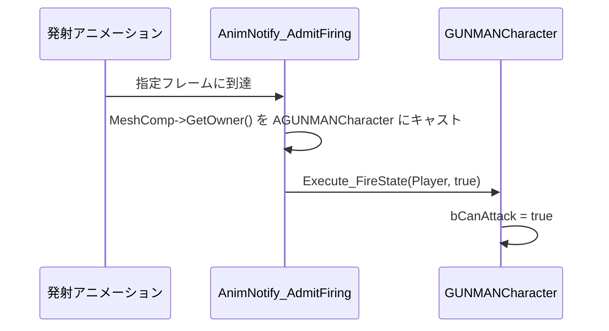

# AnimNotify_AdmitFiring クラスの概要

ソースコード: `Source/GUNMAN/Animations/AnimNotify/AnimNotify_AdmitFiring.h / .cpp`

## 概要

`UAnimNotify_AdmitFiring` は `UAnimNotify` を継承したクラスです。  
発射アニメーションの「発砲開始タイミング」フレームに配置され、`GUNMANCharacter` の `bCanAttack` を `true` にすることで連射を許可します。

アニメーションエディタでの表示名は **"AdmitFiring"** です。

## 動作の流れ

## 関数の説明

### `Notify(USkeletalMeshComponent* MeshComp, UAnimSequenceBase* Animation)`
1. `MeshComp->GetOwner()` を `AGUNMANCharacter` にキャスト
2. キャスト成功後、`IAnimationInterface` にキャストして `Execute_FireState(Player, true)` を呼ぶ
3. これにより `GUNMANCharacter::FireState_Implementation(true)` が実行され `bCanAttack = true` になる

### `GetNotifyName_Implementation()`
エディタ上での表示名として `"AdmitFiring"` を返します。
