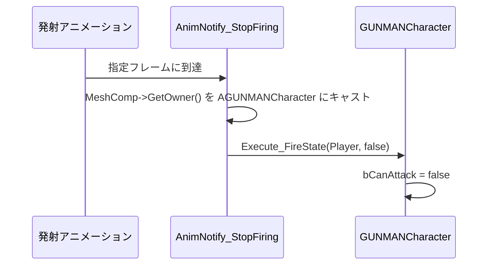

# AnimNotify_StopFiring クラスの概要

ソースコード: `Source/GUNMAN/Animations/AnimNotify/AnimNotify_StopFiring.h / .cpp`

## 概要

`UAnimNotify_StopFiring` は `UAnimNotify` を継承したクラスです。  
発射アニメーションの「発砲終了タイミング」フレームに配置され、`GUNMANCharacter` の `bCanAttack` を `false` にすることで連射を制限します。

`AnimNotify_AdmitFiring` と対になって使用されます。アニメーションエディタでの表示名は **"StopFiring"** です。

## 動作の流れ

## 関数の説明

### `Notify(USkeletalMeshComponent* MeshComp, UAnimSequenceBase* Animation)`
1. `MeshComp->GetOwner()` を `AGUNMANCharacter` にキャスト
2. キャスト成功後、`IAnimationInterface` にキャストして `Execute_FireState(Player, false)` を呼ぶ
3. これにより `GUNMANCharacter::FireState_Implementation(false)` が実行され `bCanAttack = false` になる

### `GetNotifyName_Implementation()`
エディタ上での表示名として `"StopFiring"` を返します。
