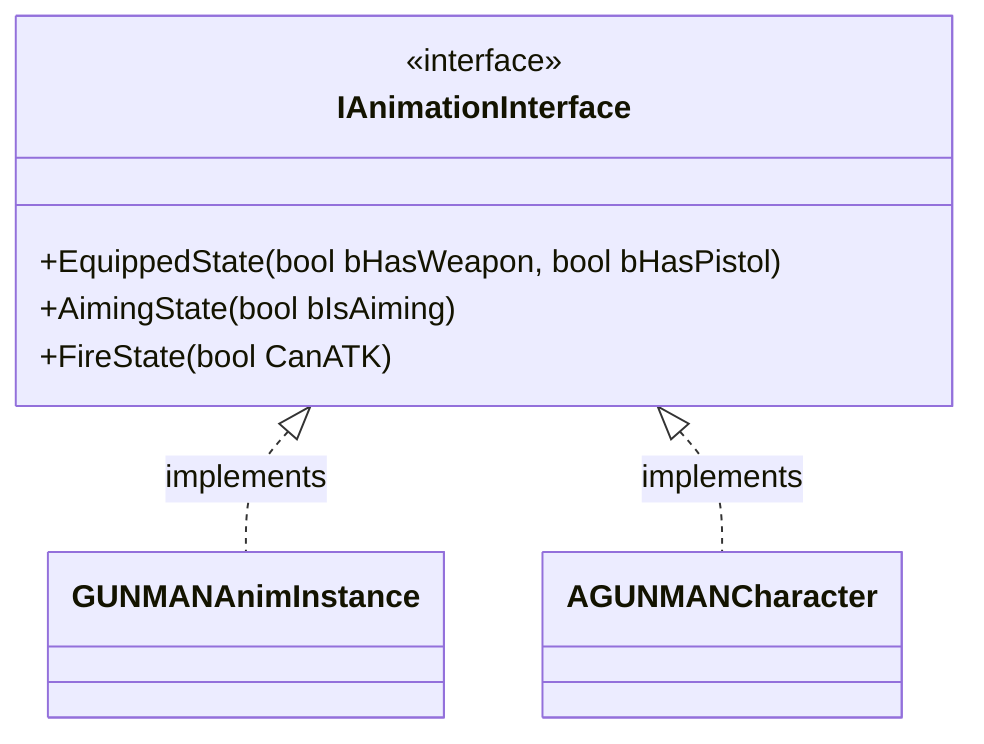

# AnimationInterface クラスの概要

ソースコード: `Source/GUNMAN/Animations/AnimationInterface.h / .cpp`

## 概要

`IAnimationInterface` は、アニメーションインスタンスの状態をゲームプレイ側から制御するためのインターフェースです。  
`GUNMANCharacter` は具体的なアニメーションクラスを知らずに、このインターフェース経由で状態を通知します。  
`BlueprintNativeEvent` として宣言されているため、C++ と Blueprint の両方で実装できます。

## 関数の説明

### `EquippedState(bool bHasWeapon, bool bHasPistol)`

武器の装備状態をアニメーションインスタンスに通知します。

| 引数 | 説明 |
|---|---|
| `bHasWeapon` | 武器を装備しているか |
| `bHasPistol` | ピストル系の武器か（アニメーションのポーズ分岐に使用） |

`GUNMANCharacter::EquipWeapon()` から呼ばれます。

### `AimingState(bool bIsAiming)`

エイム状態をアニメーションインスタンスに通知します。  
`GUNMANCharacter::GunPreparationProcess()` から呼ばれます。

### `FireState(bool CanATK)`

発砲可否を `GUNMANCharacter` 側に通知します。  
`AnimNotify_AdmitFiring` が `true`、`AnimNotify_StopFiring` が `false` を渡します。  
実装先は `GUNMANCharacter::FireState_Implementation()` であり、`bCanAttack` フラグを更新します。

> **注意**: このインターフェースは `GUNMANAnimInstance`（アニメーション → ゲームプレイへの状態保持）と  
> `AGUNMANCharacter`（アニメーション通知 → ゲームプレイへのコールバック）の両方に実装されています。  
> `FireState` は後者のみが実際に使用します。
