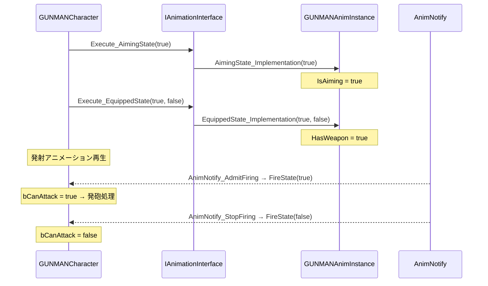

# GUNMAN - アニメーション

ソースコードの対応場所: `Source/GUNMAN/Animations/`

プレイヤーキャラクターのアニメーション制御に関するクラスです。  
インターフェース経由の疎結合設計により、`GUNMANCharacter` 側はアニメーションの実装クラスを直接知らずに状態を通知できます。

## アニメーション連携のフロー

## ファイル一覧

| ファイル | 概要 |
|---|---|
| [AnimationInterface](AnimationInterface.md) | アニメーション状態（装備・エイム・発砲）を外部から制御するためのインターフェース |
| [GUNMANAnimInstance](GUNMANAnimInstance.md) | TPS キャラクターのアニメーションインスタンス。速度・方向・エイム角度をフレームごとに更新 |
| [AnimNotify_AdmitFiring](AnimNotify_AdmitFiring.md) | 発射アニメーションの特定フレームで `FireState(true)` を呼び発砲を許可する AnimNotify |
| [AnimNotify_StopFiring](AnimNotify_StopFiring.md) | 発射アニメーションの特定フレームで `FireState(false)` を呼び発砲を停止する AnimNotify |
