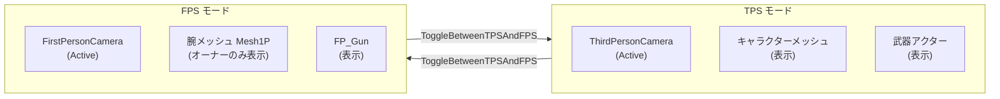
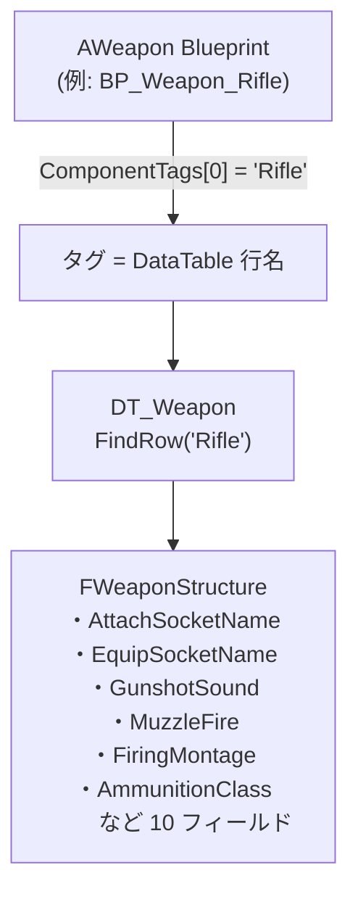
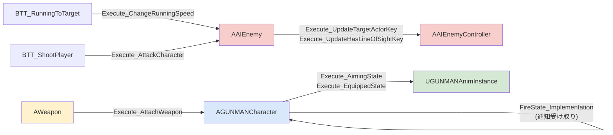
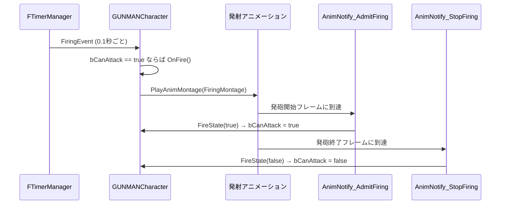
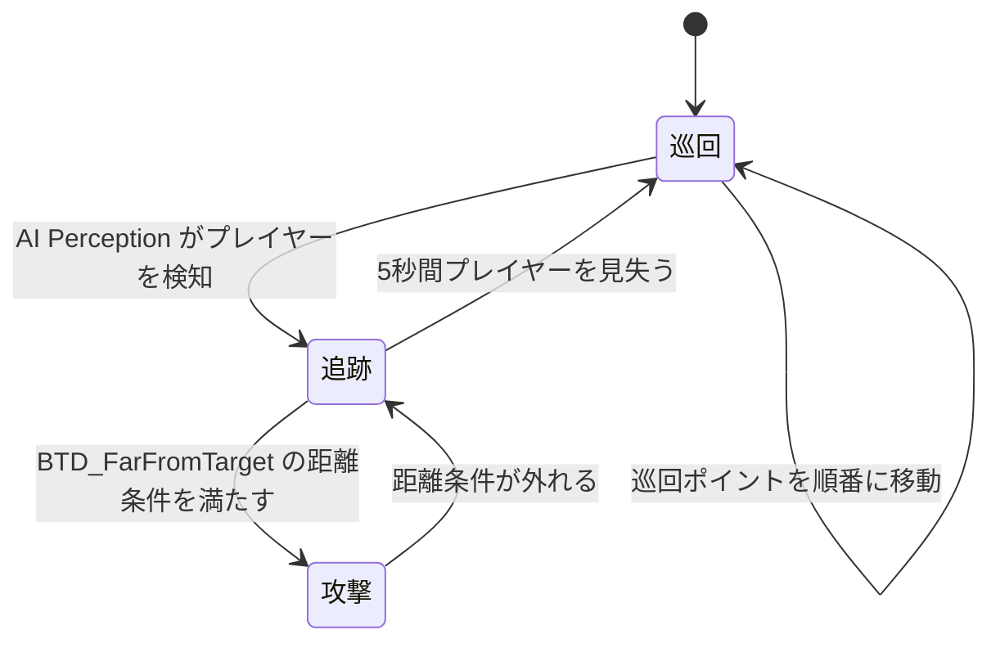
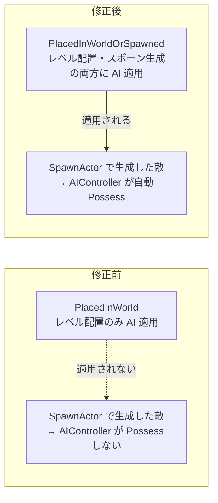
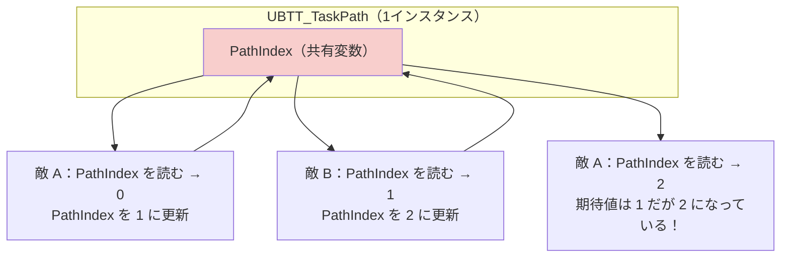
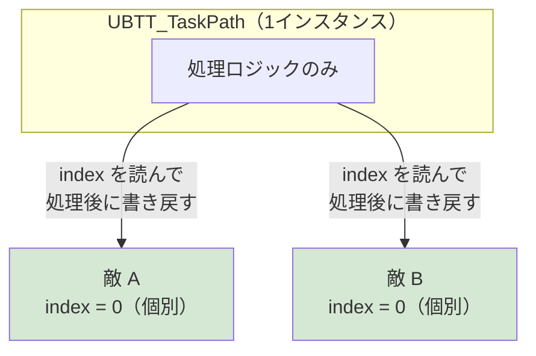

# アピールポイント

---

## 目次

1. [FPS / TPS リアルタイム視点切り替えシステム](#1-fps--tps-リアルタイム視点切り替えシステム)
2. [データ駆動武器システム](#2-データ駆動武器システム)
3. [インターフェースによる疎結合設計](#3-インターフェースによる疎結合設計)
4. [AnimNotify による発砲タイミング同期](#4-animnotify-による発砲タイミング同期)
5. [Behavior Tree を用いた AI の設計](#5-behavior-tree-を用いた-ai-の設計)
6. [不具合解決①：スポーン生成した敵に AI が適用されない](#6-不具合解決スポーン生成した敵に-ai-が適用されない)
7. [不具合解決②：複数の敵が巡回インデックスを共有してしまう](#7-不具合解決複数の敵が巡回インデックスを共有してしまう)

---

## 1. FPS / TPS リアルタイム視点切り替えシステム

### 概要

ボタン 1 つで FPS（一人称）と TPS（三人称）をシームレスに切り替えられるシステムを実装しました。  
単純なカメラ切り替えではなく、メッシュ表示・入力制御・照準 UI・武器表示が連動して切り替わります。

### 実装の設計



**切り替え時に制御する要素：**

| 要素 | TPS 時 | FPS 時 |
|---|---|---|
| `ThirdPersonCamera` | Active | Inactive |
| `FirstPersonCamera` | Inactive | Active |
| `GetMesh()`（三人称ボディ） | 表示 | 非表示 |
| `Mesh1P`（一人称腕） | 非表示 | 表示（オーナーのみ） |
| `FP_Gun` | 非表示 | 表示 |
| `AWeapon` アクター全体 | 表示 | 非表示 |
| `bUseControllerRotationYaw` | false | true |
| 照準 UI | エイム中のみ表示 | 非表示 |

### こだわりのポイント

**① カメラブームの壁衝突自動補正**

TPS 時にキャラクターが壁に近づくと、毎フレーム `ChangeCameraOffset` がライントレースで壁を検出し、`FMath::Lerp` でカメラを滑らかに引き寄せます。

```
通常時:    TargetArmLength → 300
エイム時:  TargetArmLength → 300 + SocketOffset を CameraBoomSocketOffset に補間
壁接近時:  TargetArmLength → 100 + SocketOffset を (0, 0, 60) に補間
```

**② FPS 専用腕メッシュの可視性設計**

`Mesh1P` は `SetOnlyOwnerSee(true)` を設定しており、マルチプレイ拡張時でも他のプレイヤーには見えません。  
反対にキャラクター本体（`GetMesh()`）は FPS 時に非表示にすることで、カメラが自分のボディを突き抜けません。

---

## 2. データ駆動武器システム

### 概要

武器の仕様（サウンド・エフェクト・アニメーション・弾薬クラスなど）をすべて DataTable（`DT_Weapon`）で管理し、**C++ コードを一切変更せず武器を追加・変更できる**設計を採用しました。

### 設計の核心：ComponentTags によるキー管理



`AWeapon::BeginPlay` では `WeaponMesh->ComponentTags[0]` を DataTable のキーとして使います。  
Blueprint 側でタグを `"Rifle"` / `"Shotgun"` / `"Pistol"` に設定するだけで、同一の C++ クラスから異なる武器設定を読み込めます。

```cpp
// AWeapon::BeginPlay より
FName RowName = WeaponMesh->ComponentTags[0];          // タグを行名に使う
FWeaponStructure* Row = WeaponDataTable->FindRow<FWeaponStructure>(RowName, "");
if (Row)
{
    Interface->Execute_AttachWeapon(Player, WeaponMesh, Row->AttachSocketName);
}
```

### 武器追加の手順

新しい武器を追加するときは以下の 2 ステップだけです：

1. `DT_Weapon` に新しい行を追加してパラメータを設定する
2. `AWeapon` を継承した Blueprint を作成し、`WeaponMesh->ComponentTags[0]` に行名を設定する

**C++ ファイルへの変更はゼロ**であり、デザイナーが単独で武器を追加できます。

### プレイヤーと敵が同じ DataTable を共有

`AGUNMANCharacter`（プレイヤー）と `AAIEnemy`（敵）が同じ `DT_Weapon` を参照しています。  
プレイヤーはタグから行名を動的に決定し、敵は `"Rifle"` をハードコードで参照します。  
共通データソースを持つことでサウンドや演出の一貫性が保たれます。

---

## 3. インターフェースによる疎結合設計

### 概要

システム間の依存を最小化するため、4 つの `BlueprintNativeEvent` インターフェースを設計しました。  
呼び出し側は具体的なクラスを知らずに機能を呼び出せるため、Blueprint 拡張や派生クラスへの差し替えが容易です。

### インターフェース一覧と依存関係



### 設計のメリット

**① Behavior Tree タスクが敵の具体的なクラスを知らない**

`BTT_ShootPlayer` は `IAIEnemyInterface` にキャストするだけで攻撃を実行できます。  
`AAIEnemy` の派生クラスを作っても、インターフェースを実装すれば同じタスクが使えます。

```cpp
// BTT_ShootPlayer::ExecuteTask より
IAIEnemyInterface* Interface = Cast<IAIEnemyInterface>(Enemy);
if (Interface)
{
    Interface->Execute_AttackCharacter(Enemy);  // 具体クラスを知らずに呼び出せる
}
```

**② Blueprint でも実装できる**

`BlueprintNativeEvent` のため、C++ の実装をそのまま使うことも、Blueprint でオーバーライドすることも可能です。  
デザイナーがロジックをカスタマイズする際に C++ を触る必要がありません。

---

## 4. AnimNotify による発砲タイミング同期

### 概要

発射アニメーションとゲームロジックを **AnimNotify** で同期させ、アニメーションの進行に合わせて発砲可否を制御しました。  
これにより、連射速度がアニメーションの長さで自然に決まり、視覚的な整合性が保たれます。

### 仕組み



### なぜこの設計を選んだか

**単純なタイマーだけで制御した場合の問題点：**

タイマー間隔（`FiringInterval = 0.1f`）を短くすると、アニメーションが完了する前に次の発射処理が走り、モーションと効果音がずれます。  
タイマー間隔をアニメーション長さに合わせると、アニメーション変更のたびにコードも変更が必要になります。

**AnimNotify を使った解決策：**

`bCanAttack` フラグをアニメーション側が制御するため、アニメーションの長さが変わっても C++ コードを変更する必要がありません。  
タイマーは「一定間隔で発射を試みる」だけ担当し、実際に発射できるかの判断はアニメーション側に委ねます。

---

## 5. Behavior Tree を用いた AI の設計

### 概要

Unreal Engine の Behavior Tree と AI Perception を組み合わせ、「巡回」「追跡」「攻撃」の 3 状態を切り替える敵 AI を実装しました。  
3 種類の行動パターン（PathA 巡回・PathB 巡回・ランダム巡回）を 1 つの Behavior Tree で管理しています。

### AI の行動フロー



### 各コンポーネントの役割分担

| コンポーネント | 役割 |
|---|---|
| `UAIPerceptionComponent`（視覚） | プレイヤーを視界に捉えたとき Blackboard の `TargetActor` を更新 |
| `BTD_FarFromTarget`（デコレーター） | 敵とプレイヤーの距離で「追跡」ブランチの実行を制御 |
| `BTT_TaskPath`（タスク） | タグ（PathA/PathB/Random）で巡回方式を切り替え |
| `BTT_RunningToTarget`（タスク） | `ChangeRunningSpeed` で速度を上げてプレイヤーへ移動 |
| `BTT_ShootPlayer`（タスク） | `AttackCharacter` で発砲・ライントレースによるダメージ適用 |

### 巡回インデックスの設計

巡回ポイントの管理は `AAIEnemy::index` に分散させています。  
タスクインスタンスを複数の敵が共有するため、インデックスをタスク側に持つと競合が起きます（詳細は [不具合解決②](#7-不具合解決複数の敵が巡回インデックスを共有してしまう) を参照）。

---

## 6. 不具合解決①：スポーン生成した敵に AI が適用されない

### 状況

`AEnemyTargetPoint` でタイマーを使って敵を動的にスポーンしましたが、**生成された敵が棒立ちのまま動かない**という問題が発生しました。  
レベルエディタ上に直接配置した敵は正常に動いていたため、スポーン処理に原因があると判断しました。

### 原因の特定

`EAutoPossessAI` 列挙型の設定が間違っていました。



**修正箇所（`AAIEnemy` コンストラクタ）：**

```cpp
// 修正前
AutoPossessAI = EAutoPossessAI::PlacedInWorld;

// 修正後
AutoPossessAI = EAutoPossessAI::PlacedInWorldOrSpawned;
```

### 学び

UE5 の `EAutoPossessAI` には以下の選択肢があります：

| 設定値 | 適用タイミング |
|---|---|
| `Disabled` | 自動 Possess しない |
| `PlacedInWorld` | レベルエディタで配置したときのみ |
| `Spawned` | 実行時に `SpawnActor` で生成したときのみ |
| `PlacedInWorldOrSpawned` | 両方に適用 |

**実行時スポーンは `PlacedInWorld` の対象外**というエンジンの仕様を把握していなかったことが原因でした。  
「ゲームを起動したら動いた」を確認するだけでなく、「実行時生成でも動くか」を別途検証する必要があることを学びました。

---

## 7. 不具合解決②：複数の敵が巡回インデックスを共有してしまう

### 状況

複数の敵が同じ巡回ルートを使用する場合、**巡回順序がバラバラになる**という問題が発生しました。  
期待する順序 `0 → 1 → 2 → 3` に対し、実際は `0 → 2 → 3 → 0` のように飛びが発生していました。

### 原因の特定

Behavior Tree のタスクインスタンスは、**同一タスクを使う全ての AI が共有**します。  
`PathIndex` をタスクのメンバー変数として持つと、複数の敵が互いに値を上書きし合う競合が起きていました。



### 解決策

インデックスの保持場所をタスクから**各敵キャラクター（`AAIEnemy`）**に移しました。

```cpp
// AAIEnemy.h に追加
public:
    int index = 0;  // 各敵が自分の巡回インデックスを個別に保持
```

```cpp
// BTT_TaskPath::ExecuteTask
auto Enemy = Cast<AAIEnemy>(ControlledPawn);
PathIndex = Enemy->index;                              // 敵から読み込む
// ... 座標を計算 ...
Enemy->index = SelectInt(bCondition, PathIndex + 1, 0); // 敵に書き戻す
```



### 学び

Behavior Tree のタスクは複数の AI エージェントで共有されるため、**エージェント固有の状態はタスクに持たせてはいけない**という UE5 AI システムの重要な設計原則を学びました。

エージェント固有データの置き場所は以下の 3 選択肢があります：

| 置き場所 | 用途 |
|---|---|
| キャラクタークラスのメンバー | 永続的な状態（今回の `index` はこれ） |
| Blackboard の値 | 他のタスクやデコレーターと共有したい状態 |
| `NodeMemory`（タスクのメモリ領域） | タスク実行中のみ必要な一時データ |

今後は複数のエージェントで同じタスクを使う場合、状態の共有スコープを意識した設計を行います。
