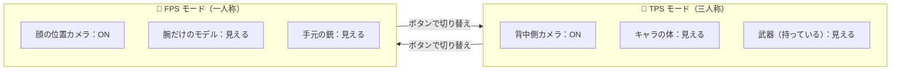
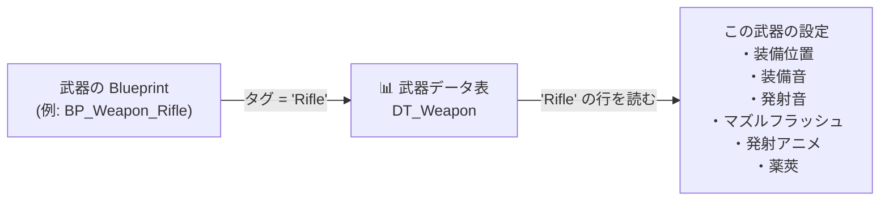
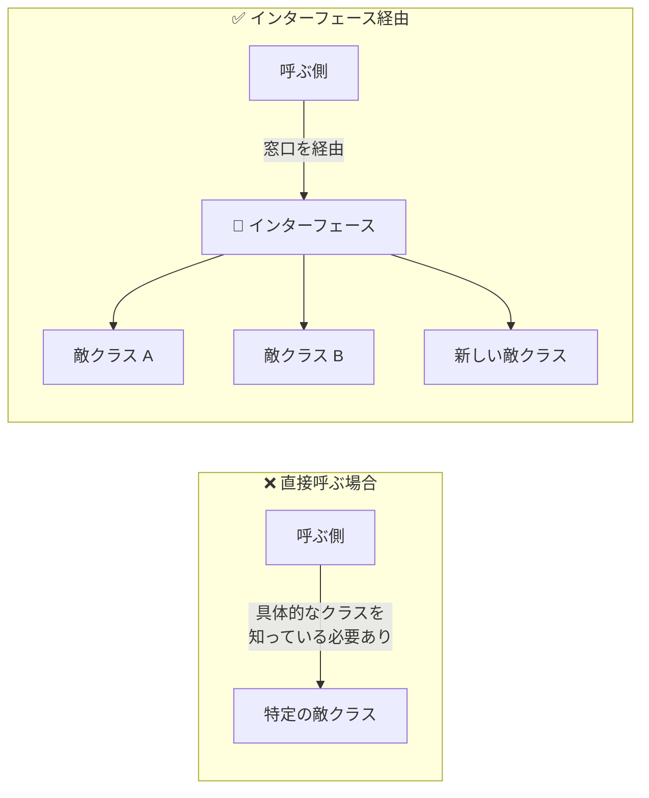
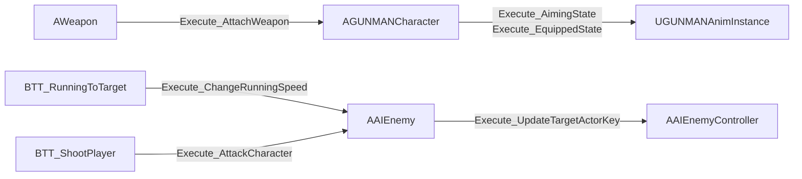
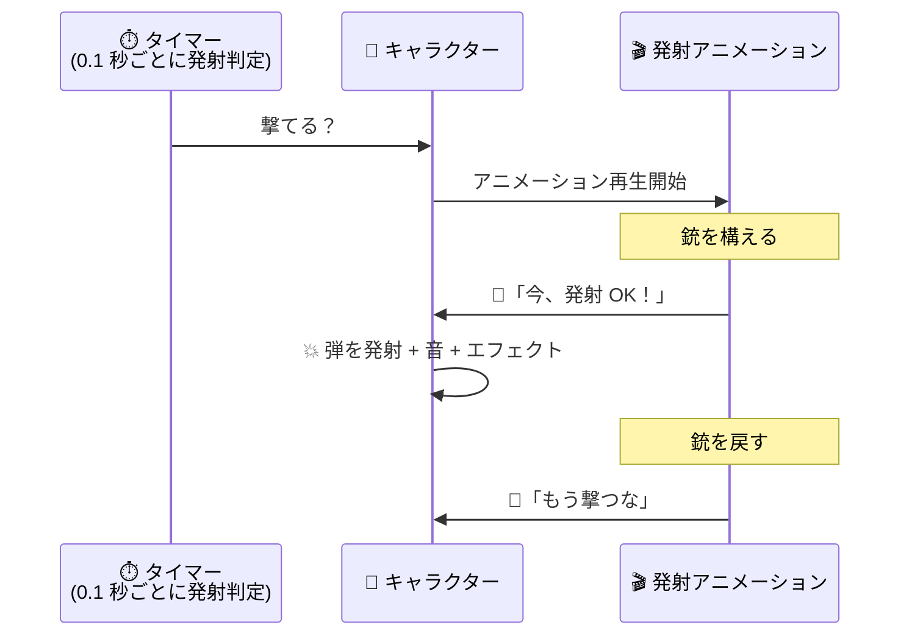
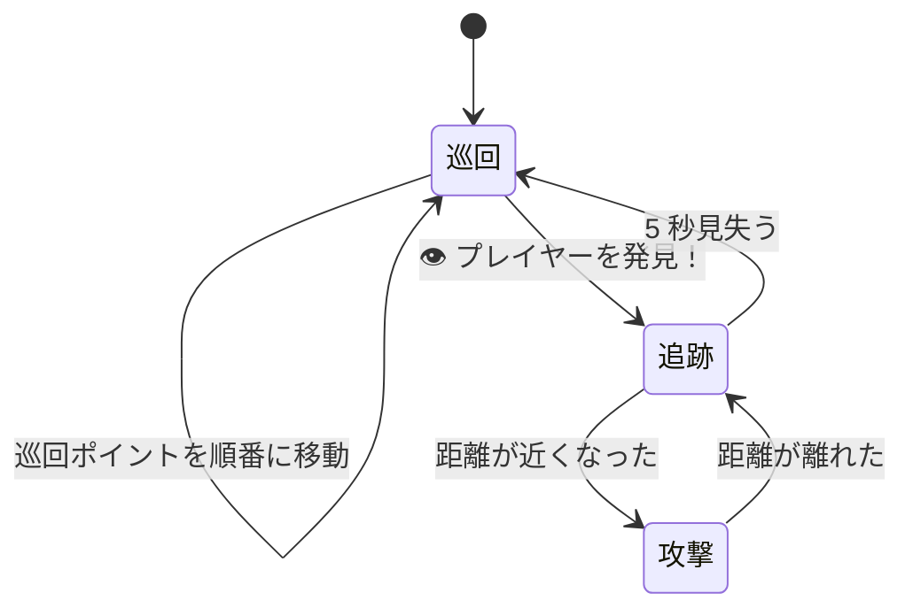
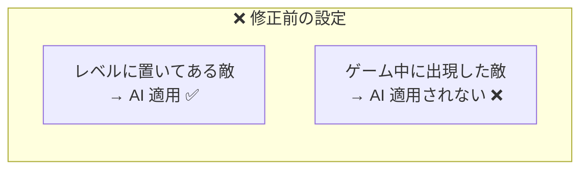
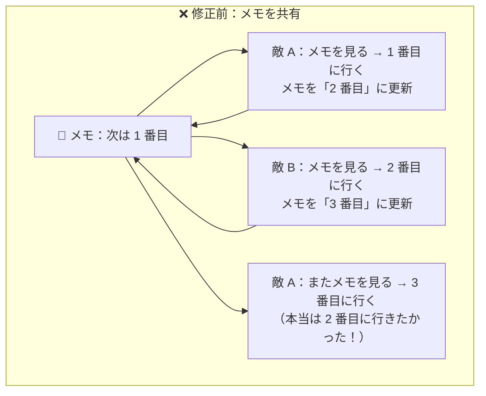
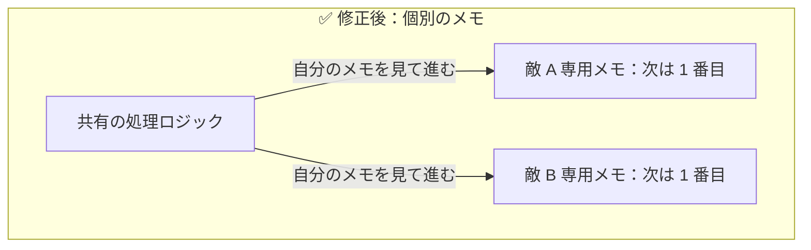

# GUNMAN - 制作目的・アピールポイント

> [!NOTE]
> このドキュメントは **プログラマー以外（プランナー・デザイナー・採用担当など）の方にも内容が伝わるよう** に構成しています。
>
> 各項目は次の流れで説明しています：
>
> - ✨ **何ができるようになったか** — 1 行で
> - 👥 **誰にとってメリットがあるか** — 役割別の効果
> - 🛠️ **どんな仕組みか** — 比喩を交えて
> - 📄 **技術詳細（コード）** — ▶ をクリックすると展開

---

## 目次

1. [制作目的](#1-制作目的)
2. [FPS / TPS をリアルタイムに切り替えるデュアルカメラシステム](#2-fps--tps-をリアルタイムに切り替えるデュアルカメラシステム)
3. [武器をエディタだけで追加できるデータ駆動システム](#3-武器をエディタだけで追加できるデータ駆動システム)
4. [部品の組み換えを楽にする「インターフェース」設計](#4-部品の組み換えを楽にするインターフェース設計)
5. [アニメーションと発砲を完璧に同期させる仕組み](#5-アニメーションと発砲を完璧に同期させる仕組み)
6. [3 つの行動を切り替える敵 AI](#6-3-つの行動を切り替える敵-ai)
7. [不具合解決①：スポーンした敵が動かない問題](#7-不具合解決スポーンした敵が動かない問題)
8. [不具合解決②：敵の巡回順序が乱れる問題](#8-不具合解決敵の巡回順序が乱れる問題)
9. [まとめ](#9-まとめ)

---

## 1. 制作目的

サバイバルアクション FPS/TPS ゲームを **C++ でフルスクラッチ実装** することで、Unreal Engine の中核機能を体系的に習得することを目的としました。

特に次の領域を **「動くだけ」ではなく「設計として正しく」** 実装することに取り組みました：

- **Behavior Tree と AI Perception** — 状況に応じて行動を切り替える敵 AI
- **データ駆動設計** — プログラマー以外でもゲーム拡張ができる仕組み
- **インターフェース設計** — 拡張に強いクラス間の疎結合
- **Enhanced Input System** — モダンなキー設定アーキテクチャ

「個人開発で動くもの」ではなく、**「チーム開発でも破綻しない設計」** を目指したことが本プロジェクトの大きなテーマです。

---

## 2. FPS / TPS をリアルタイムに切り替えるデュアルカメラシステム

> 技術名：**デュアルカメラ + 連動表示制御**

### ✨ 何ができるようになったか

ボタン 1 つで **「三人称（肩越し）視点」と「一人称（主観）視点」を瞬時に切り替えられる** ようにしました。カメラだけでなく、キャラクターの体・武器・照準まで全てが連動して切り替わります。

### 👥 誰にとってメリットがあるか

| 役割 | メリット |
|---|---|
| **プレイヤー** | 「広く見渡したい」「狙いを定めたい」など状況に応じて視点を選べる |
| **プランナー** | 「ここは FPS が映える」「ここは TPS で広く見せたい」とレベル設計に視点演出を組み込める |
| **プログラマー** | 切り替えロジックを 1 か所に集約しており、新マップで追加実装が不要 |

### 🛠️ どんな仕組みか

切り替えるのは「カメラ」だけではありません。次の 8 つの要素が **同時に切り替わります**。



| 切り替える要素 | TPS のとき | FPS のとき |
|---|---|---|
| 三人称カメラ | ON | OFF |
| 一人称カメラ | OFF | ON |
| キャラクターの体（全身） | 見える | 見えない（カメラ映り込み防止） |
| 一人称用の腕 | 見えない | 見える（自分にだけ） |
| 一人称用の銃 | 見えない | 見える |
| 地面に落ちている武器 | 見える | 見えない |
| キャラクターの向き | 移動方向 | カメラ方向（照準と一致） |
| 照準（クロスヘア） | エイム中のみ | 常に非表示 |

**こだわりポイント：** 壁にカメラがめり込まないように、毎フレーム前方をチェックして壁を検出したら自動でカメラを引き寄せます。

<details>
<summary>📄 技術詳細（クリックで展開）</summary>

毎フレーム `ChangeCameraOffset` がライントレースで壁を検出し、`FMath::Lerp` で `CameraBoom->TargetArmLength` と `SocketOffset` を補間します。

```cpp
// GUNMANCharacter.cpp（抜粋）
void AGUNMANCharacter::ChangeCameraOffset(float& DeltaTime)
{
    if (bIsFP) return;

    FHitResult HitResult;
    UKismetSystemLibrary::LineTraceSingle(/* ... */);

    if (HitResult.bBlockingHit)
    {
        // 壁衝突時：カメラを引き寄せてクリッピングを防ぐ
        CameraBoom->TargetArmLength = FMath::Lerp(CameraBoom->TargetArmLength, 100.0f, DeltaTime);
        CameraBoom->SocketOffset = FMath::Lerp(CameraBoom->SocketOffset, FVector(0, 0, 60), DeltaTime);
    }
    // ...
}
```

`Mesh1P`（FPS 腕メッシュ）は `SetOnlyOwnerSee(true)` でオーナーにのみ可視。切り替えは `ToggleBetweenTPSAndFPS()` → `ToggleFlipflop(bIsTPActive, bIsFPActive)` の流れで実行されます。

詳細は [`GUNMANCharacter.md`](Character/GUNMANCharacter.md) を参照。

</details>

---

## 3. 武器をエディタだけで追加できるデータ駆動システム

> 技術名：**DataTable + ComponentTags**

### ✨ 何ができるようになったか

武器の仕様（音・エフェクト・アニメーションなど）をすべて **Excel のような表で管理** しました。プログラマーが C++ を変更しなくても、**Blueprint と DataTable だけで新しい武器を追加** できます。

### 👥 誰にとってメリットがあるか

| 役割 | メリット |
|---|---|
| **プランナー** | 「ピストルの発射音を変えたい」など武器のパラメータ調整をエディタで完結できる |
| **デザイナー** | 武器メッシュとエフェクトを差し替えてバリエーションを作れる |
| **プログラマー** | 武器追加・調整のたびにビルドし直す必要がない |

### 🛠️ どんな仕組みか



ポイントは **武器メッシュに付けた「タグ」が、データ表の行名になっている** ことです。タグを `"Rifle"` にすればライフルの設定、`"Pistol"` にすればピストルの設定が自動で読み込まれます。

**武器を 1 つ追加する手順は 2 ステップだけ：**

1. 武器データの表（DataTable）に新しい行を追加
2. その武器の Blueprint を作って、メッシュにタグを付ける

おまけに、プレイヤーキャラクターも敵キャラクターも **同じデータ表を見ています**。「ライフルの発射音を変えた」ら、プレイヤーも敵も同時に新しい音が鳴ります。

<details>
<summary>📄 技術詳細（クリックで展開）</summary>

`AWeapon::BeginPlay` で `WeaponMesh->ComponentTags[0]` を DataTable のキーとして使います。

```cpp
// AWeapon::BeginPlay より
FName RowName = WeaponMesh->ComponentTags[0];
FWeaponStructure* Row = WeaponDataTable->FindRow<FWeaponStructure>(RowName, "");
if (Row)
{
    Interface->Execute_AttachWeapon(Player, WeaponMesh, Row->AttachSocketName);
}
```

`FWeaponStructure` は 10 フィールドを持つ構造体で、`FTableRowBase` を継承して DataTable の行として使えます。詳細は [`WeaponStructure.md`](Weapon/WeaponStructure.md) を参照。

</details>

---

## 4. 部品の組み換えを楽にする「インターフェース」設計

> 技術名：**BlueprintNativeEvent インターフェース**

### ✨ 何ができるようになったか

システム同士の繋がりを **「規格化された窓口」経由** にすることで、部品の差し替え・拡張を楽にしました。USB ポートのように、規格さえ合えば中身の機器が違っても繋がる仕組みです。

### 👥 誰にとってメリットがあるか

| 役割 | メリット |
|---|---|
| **プランナー** | 「ボス敵を追加したい」「特殊な攻撃をする敵を作りたい」を既存の仕組みを壊さず実現できる |
| **デザイナー** | Blueprint で独自の挙動を書き足せる（C++ 不要） |
| **プログラマー** | 新クラスの追加で既存コードに影響が及ばない |

### 🛠️ どんな仕組みか

通常のプログラムでは、A が B を呼び出すには「A が B の中身を全部知っている」必要があります。これだと B を変更するたびに A も書き換えが必要です。

**インターフェースを使うと、A は B の「窓口」だけを知っていれば呼び出せます**。



GUNMAN では 4 つの窓口を用意しています。

| インターフェース | 何の窓口か |
|---|---|
| `IAnimationInterface` | アニメーション状態を伝える（装備した・狙ってる・撃った） |
| `IWeaponInterface` | 武器をキャラクターに取り付ける |
| `IAIEnemyInterface` | 敵に「攻撃しろ」「スピードを変えろ」と命令する |
| `IEnemyAIControllerInterface` | 敵 AI コントローラーに「ターゲット情報を更新しろ」と命令する |

たとえば「新種の敵」を作ったとき、攻撃命令を出す Behavior Tree 側のコードを **一切変更せずに** 動かせます。

<details>
<summary>📄 技術詳細（クリックで展開）</summary>

4 つのインターフェースは全て `BlueprintNativeEvent` として宣言されており、C++ と Blueprint の両方で実装できます。

```cpp
// BTT_ShootPlayer::ExecuteTask より
IAIEnemyInterface* Interface = Cast<IAIEnemyInterface>(Enemy);
if (Interface)
{
    Interface->Execute_AttackCharacter(Enemy);  // 具体クラスを知らずに呼び出せる
}
```

依存関係：



</details>

---

## 5. アニメーションと発砲を完璧に同期させる仕組み

> 技術名：**AnimNotify**

### ✨ 何ができるようになったか

銃を撃つアニメーションと、実際に弾が出るタイミングを **完璧に同期** させました。アニメーションが「今だ！」と教えてくれた瞬間に弾を発射します。

### 👥 誰にとってメリットがあるか

| 役割 | メリット |
|---|---|
| **プレイヤー** | 銃の動き・効果音・弾の発射タイミングがズレず、連射してももたつかない |
| **アニメーター** | アニメーションを差し替えても、コード修正なしで発射タイミングが自動調整される |
| **プログラマー** | 武器ごとに発射間隔を C++ で個別管理する必要がない |

### 🛠️ どんな仕組みか



ポイントは **アニメーション側に「ここで撃って OK」「ここからは撃つな」という合図を埋め込んでいる** ことです。コードはタイマーで定期的に「撃てる？」と聞くだけで、実際に撃つかの判断はアニメーションに任せています。

別の方式と比較：

| 方式 | 問題点 |
|---|---|
| タイマー間隔を短くする | アニメーションが完了する前に次の発射が始まり、動作がカクカクになる |
| タイマー間隔をアニメ長さに合わせる | アニメ変更のたびにコード書き換えが必要 |
| **アニメから合図を出す（採用方式）** | **アニメを変えてもコード修正不要** |

<details>
<summary>📄 技術詳細（クリックで展開）</summary>

`AnimNotify_AdmitFiring` と `AnimNotify_StopFiring` の 2 つの AnimNotify がアニメーションモンタージュに配置されており、それぞれが呼ばれた時点で `GUNMANCharacter::bCanAttack` を `true` / `false` にします。

```
[Timer 0.1秒ごと] FiringEvent() 呼び出し
  └─ bCanAttack == true なら OnFire() 実行
[Anim 再生] 発射アニメーション開始
  ├─ AnimNotify_AdmitFiring 発火 → FireState(true) → bCanAttack = true
  └─ AnimNotify_StopFiring 発火 → FireState(false) → bCanAttack = false
```

`FireState` は `IAnimationInterface` 経由で呼ばれ、`GUNMANCharacter::FireState_Implementation` で実装されています。詳細は [`AnimNotify_AdmitFiring.md`](Animation/AnimNotify_AdmitFiring.md) を参照。

</details>

---

## 6. 3 つの行動を切り替える敵 AI

> 技術名：**Behavior Tree + AI Perception**

### ✨ 何ができるようになったか

敵が状況に応じて **「巡回」「追跡」「攻撃」の 3 つの行動を自動で切り替える** システムを構築しました。さらに巡回パターンは 3 種類（決まったルート A、決まったルート B、ランダム）あります。

### 👥 誰にとってメリットがあるか

| 役割 | メリット |
|---|---|
| **プレイヤー** | 敵の挙動にメリハリがあり、待ち伏せ・回り込みなど戦略性のある戦闘を楽しめる |
| **プランナー** | 敵の行動ロジックがツリー状の図でビジュアル管理されており、確認・調整しやすい |
| **レベルデザイナー** | 巡回ポイントをエディタ上でドラッグ＆ドロップで配置できる |

### 🛠️ どんな仕組みか



3 つの巡回パターン：

| パターン | 動き |
|---|---|
| ルート A | 決められた地点を順番に巡回（`PathA` タグの敵） |
| ルート B | 別の決められたルートを巡回（`PathB` タグの敵） |
| ランダム | 半径 10 メートル以内をランダムに移動（`Random` タグの敵） |

**こだわりポイント：**

- 敵は **視覚** だけでプレイヤーを発見します（視界 5m・視野角 90 度）。背後から忍び寄れば気づかれません
- 物陰に隠れて 5 秒経つと、敵は諦めて巡回に戻ります。

<details>
<summary>📄 技術詳細（クリックで展開）</summary>

| コンポーネント | 役割 |
|---|---|
| `UAIPerceptionComponent`（視覚） | プレイヤー検知時に Blackboard の `TargetActor` を更新 |
| `BTD_FarFromTarget`（デコレーター） | 敵とプレイヤーの距離で追跡ブランチの実行を制御 |
| `BTT_TaskPath`（タスク） | タグで巡回方式を切り替え |
| `BTT_RunningToTarget`（タスク） | `ChangeRunningSpeed` で速度を上げてプレイヤーへ移動 |
| `BTT_ShootPlayer`（タスク） | `AttackCharacter` で発砲・ライントレースによるダメージ適用 |

詳細は [`Enemy/README.md`](Enemy/README.md) を参照。

</details>

---

## 7. 不具合解決①：スポーンした敵が動かない問題

### ❌ 状況

`AEnemyTargetPoint` でタイマーを使って敵を動的にスポーンしたところ、**生成された敵が棒立ちのまま 1 ミリも動かない** 問題が発生しました。

レベルエディタに直接配置した敵は正常に動いていたため、スポーン処理に原因があると判断しました。

### 🔍 原因

Unreal Engine には「敵を操る AI コントローラーをいつ取り付けるか」という設定があります。最初の設定は **「レベルに最初から置いてある敵にだけ取り付ける」** になっていました。



ゲーム中に出現する敵には **AI コントローラーが付かない** ため、操作する人がいなくて棒立ちになっていたわけです。

### ✅ 解決

設定を **「レベルに置いてあっても、ゲーム中に出現しても、どちらでも AI を取り付ける」** に変更しました。

```cpp
// 修正前
AutoPossessAI = EAutoPossessAI::PlacedInWorld;

// 修正後
AutoPossessAI = EAutoPossessAI::PlacedInWorldOrSpawned;
```

### 📚 学び

**「動いた」を確認するだけでは不十分** だということを学びました。今回のように「レベルに置いた敵」では動くのに「実行中に生成した敵」では動かないという、**条件によって挙動が変わるバグ** は、ゲーム開発でよくあります。

以後は **「色々なシチュエーションで動作するか」を検証チェックリストに追加** し、同種の問題を早期発見できるようにしました。

<details>
<summary>📄 技術詳細（クリックで展開）</summary>

`EAutoPossessAI` の選択肢：

| 設定値 | 適用タイミング |
|---|---|
| `Disabled` | 自動 Possess しない |
| `PlacedInWorld` | レベルエディタで配置したときのみ |
| `Spawned` | 実行時に `SpawnActor` で生成したときのみ |
| `PlacedInWorldOrSpawned` | 両方に適用 |

修正箇所は `AAIEnemy` コンストラクタです。詳細は [`AIEnemy.md`](Enemy/AIEnemy.md) を参照。

</details>

---

## 8. 不具合解決②：敵の巡回順序が乱れる問題

### ❌ 状況

複数の敵が同じルートを巡回するとき、**順番がバラバラ** になる問題が発生しました。

期待していた動き：
```
敵 A: 地点 0 → 1 → 2 → 3 → 0 → 1 → ...
敵 B: 地点 0 → 1 → 2 → 3 → 0 → 1 → ...
```

実際の動き：
```
敵 A: 地点 0 → 2 → 3 → 0 → 1 → ... （1 を飛ばしてる！）
敵 B: 地点 1 → 3 → 0 → 2 → ... （順番がメチャクチャ）
```

### 🔍 原因

「次に行く地点は何番目？」というメモを **全員で 1 枚しか持っていなかった** ことが原因でした。



敵 A が「次は 1」と書いて出発する前に、敵 B が同じメモを上書きしてしまう、というレース状態が起きていました。

### ✅ 解決

**敵一人ひとりに専用のメモを持たせる** ようにしました。



これで敵 A と敵 B はお互いに干渉せず、それぞれ正しい順序で巡回するようになりました。

### 📚 学び

**「共有してはいけないデータ」を見極めること** の大切さを学びました。Behavior Tree のタスクは複数の敵で共有されるという仕様を知らずに、共有してはいけない「次の地点のメモ」までそこに置いてしまったのが原因でした。

今後は **「これは全員で共有していい情報？それとも個別に持つべき？」** を必ず意識するようになりました。

<details>
<summary>📄 技術詳細（クリックで展開）</summary>

Behavior Tree のタスクインスタンスは、同一タスクを使う全 AI で **1 つのインスタンスを共有** します。`PathIndex` をタスクのメンバー変数に置くと、複数の敵がインデックスを上書きし合うレース状態が発生していました。

```cpp
// 解決策：AAIEnemy.h に追加
public:
    int index = 0;  // 各敵が自分の巡回インデックスを個別に保持
```

```cpp
// BTT_TaskPath::ExecuteTask（修正後）
auto Enemy = Cast<AAIEnemy>(ControlledPawn);
PathIndex = Enemy->index;                                // 敵から読み込む
// ... 座標を計算 ...
Enemy->index = SelectInt(bCondition, PathIndex + 1, 0);  // 敵に書き戻す
```

エージェント固有データの置き場所：

| 置き場所 | 用途 |
|---|---|
| キャラクタークラスのメンバー | 永続的な状態（今回の `index` はこれ） |
| Blackboard の値 | 他のタスクやデコレーターと共有したい状態 |
| `NodeMemory`（タスクのメモリ領域） | タスク実行中のみ必要な一時データ |

詳細は [`BTT_TaskPath.md`](Enemy/BehaviorTree/BTT_TaskPath.md) を参照。

</details>

---

## 9. まとめ

### このプロジェクトで実現したこと

| 仕組み | プランナー / デザイナーへの効果 | プログラマーへの効果 |
|---|---|---|
| **FPS / TPS 視点切り替え** | 視点を活かしたレベル演出が設計できる | 切り替えロジックが集約されメンテしやすい |
| **データ駆動の武器システム** | 武器追加・調整をエディタで完結できる | 武器追加でビルドし直す必要がない |
| **インターフェース設計** | 新しい敵タイプを Blueprint で追加できる | 既存コードに影響を与えず拡張できる |
| **AnimNotify によるアニメ同期** | アニメ変更が C++ 修正なしで反映される | 武器ごとの発射間隔をコードで管理しなくていい |
| **Behavior Tree AI** | 敵の行動ロジックをビジュアルで確認・調整できる | 行動の追加・変更が分離されていて保守しやすい |

### 制作を通じて得たこと

このプロジェクトは「ゲームが動く」ことに加えて、**チームで開発するときに役立つ設計** を意識しました。

- 役割（プレイヤー / 敵 AI / 武器 / アニメ / UI）ごとに **責任範囲を明確に分離**
- **プログラマー以外も触れる部分**（Blueprint / DataTable / Behavior Tree）を意図的に多く確保
- **不具合解決を通じて学んだこと** をルール化し、同じ問題を繰り返さない仕組み作り

「個人開発で動くもの」ではなく、「**チーム開発でも破綻しない設計**」を目指したことが本プロジェクトの最大の学びです。
