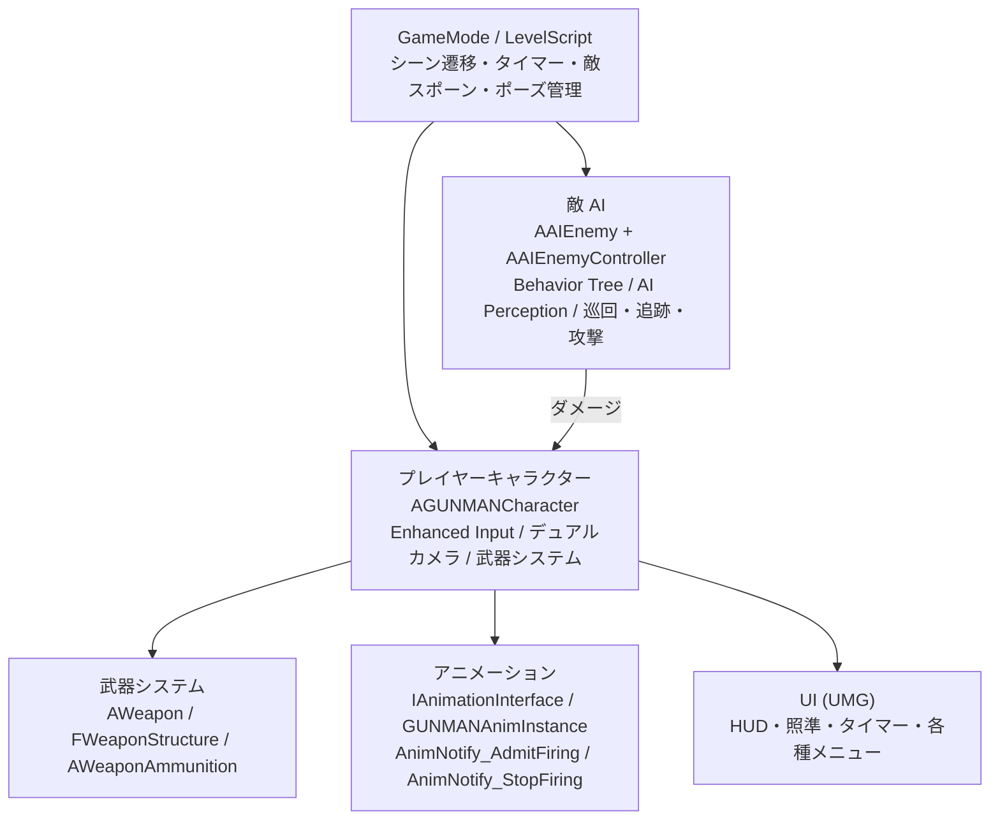
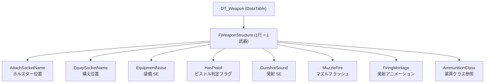
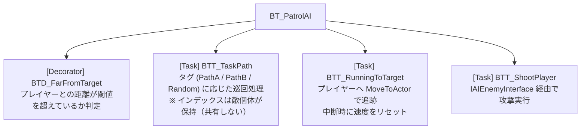
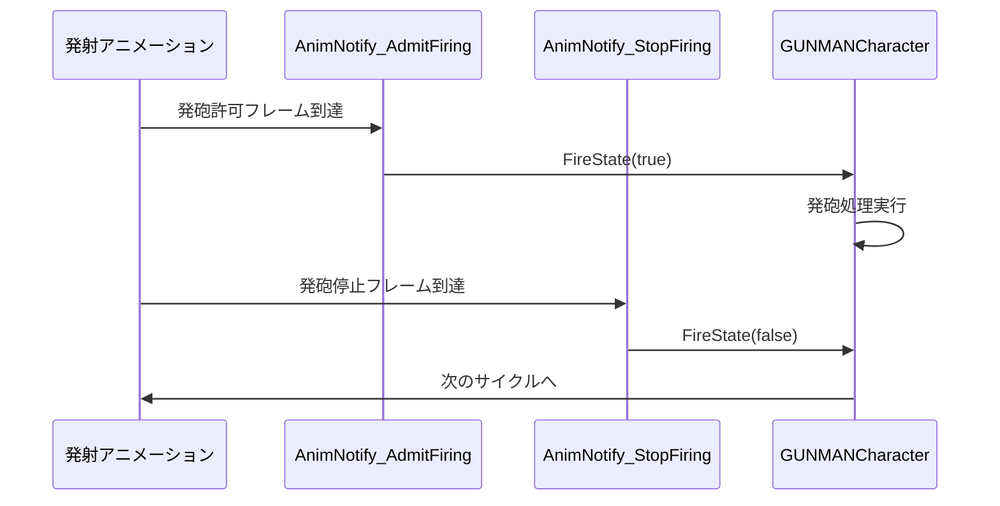
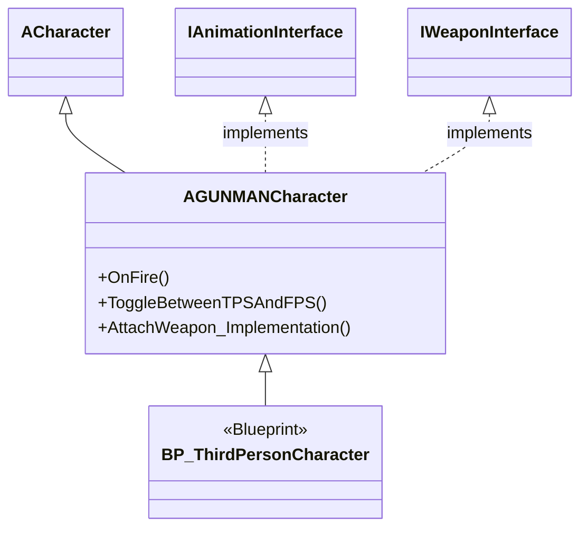
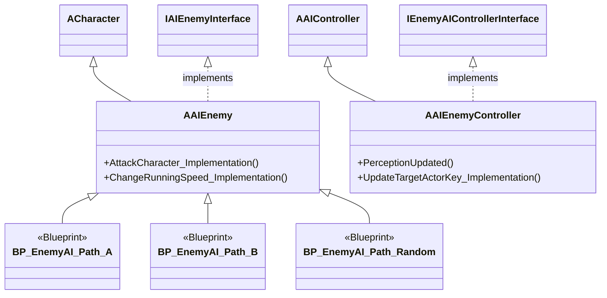
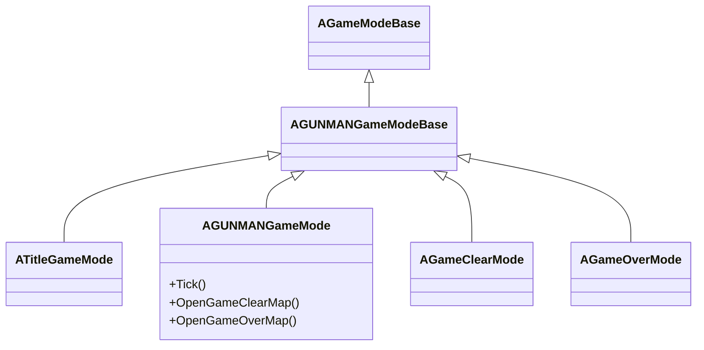
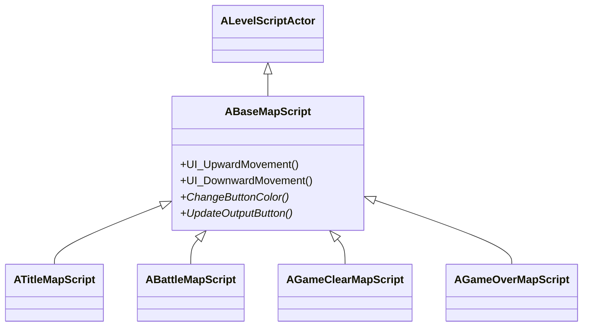
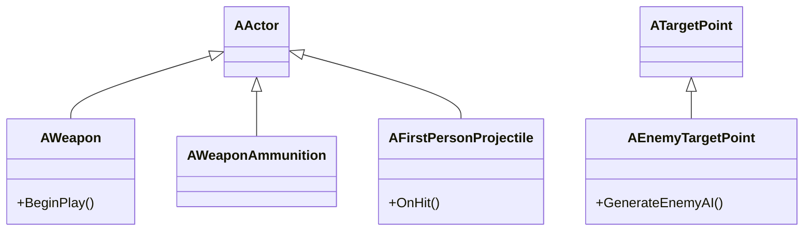

# GUNMAN - アーキテクチャ概要

## システム全体像

GUNMAN は以下の 6 つのモジュールで構成されています。

---

## 設計方針

### Interface（インターフェース）駆動設計

システム間の依存を疎結合に保つため、4 つのインターフェースを使用しています。

| インターフェース | 実装クラス | 役割 |
|---|---|---|
| `IAnimationInterface` | `GUNMANAnimInstance` | アニメーション状態の制御（装備・エイム・発砲） |
| `IWeaponInterface` | `AGUNMANCharacter` | 武器のアタッチ通知受け取り |
| `IAIEnemyInterface` | `AAIEnemy` | 攻撃・移動速度変更の命令 |
| `IEnemyAIControllerInterface` | `AAIEnemyController` | Blackboard キーの更新 |

呼び出し側は具体的なクラスを知らなくてよいため、Blueprint 拡張や派生クラスへの差し替えが容易になっています。

### データ駆動武器システム

武器固有のパラメータは全て DataTable（`DT_Weapon`）に集約されており、C++ コード側には武器の種類ごとの分岐が存在しません。

武器を追加する場合は DataTable に行を追加するだけで対応できます。

### Behavior Tree による AI 設計

敵の行動は Behavior Tree（`BT_PatrolAI`）が管理し、C++ はタスク・デコレーターを提供します。

### Timeline による速度補間

プレイヤー・敵の移動速度変化は `FTimeline` + `FloatCurve` で制御しています。
`Tick` 内でタイムラインを更新し、`FMath::FInterpTo` で速度をスムーズに補間することで、
瞬時の速度変化によるアニメーションのぎこちなさを防いでいます。

### AnimNotify による発砲タイミング同期

アニメーションの進行とゲームロジックを同期させるため、AnimNotify を使用しています。

これにより、連射速度はアニメーションの長さで自然に制御されます。

---

## シーン構成とクラスの対応

| シーン | GameMode | LevelScript | 主な UI |
|---|---|---|---|
| タイトル | `ATitleGameMode` | `ATitleMapScript` | `UITitle` |
| バトル | `AGUNMANGameMode` | `ABattleMapScript` | `UICharacter`, `UITimeLimitWidget`, `UIGunSight` |
| ゲームクリア | `AGameClearMode` | `AGameClearMapScript` | `UIGameClear` |
| ゲームオーバー | `AGameOverMode` | `AGameOverMapScript` | `UIGameOver` |

---

## クラス継承ツリー

### プレイヤー系

### 敵 AI 系

### ゲームモード系

### LevelScript 系

### 武器系

