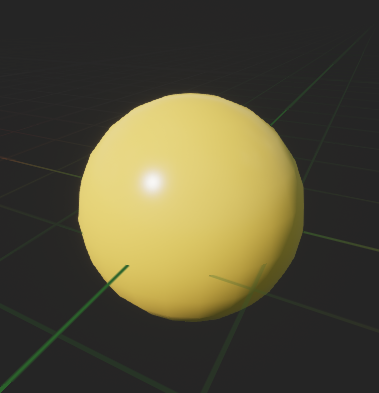
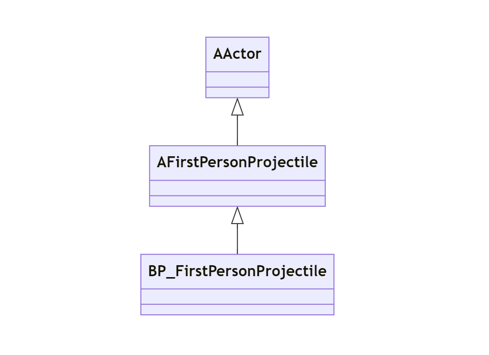

# FirstPersonProjectile クラスの概要

## 主な処理内容

`AFirstPersonProjectile` クラスは、Unreal Engine の `AActor` クラスを継承して、`GUNMANCharacter` の一人称視点で使用する弾丸（プロジェクタイル）を表現しています。  
`BP_FirstPersonProjectile` は `AFirstPersonProjectile` クラス を継承してたクラスです。  
このクラスの主な特徴は次の通りです。

- **コンポーネントの作成とプロパティの設定**:
  - `USphereComponent` を使用して、弾丸の衝突判定を表すシンプルな球体コリジョンを作成しています。
  - `UProjectileMovementComponent` により、弾丸の移動挙動を制御します（初速度やバウンドの設定など）。
- **衝突イベントの処理**:
  - `OnComponentHit` イベントに対して `OnHit` 関数をバインドし、何かに衝突した際に処理を行います。
- **デフォルトの設定**:
  - 弾丸は3秒後に自動で消滅します（`InitialLifeSpan`）。

## このクラスのソースコードの説明

### コンストラクター（`AFirstPersonProjectile::AFirstPersonProjectile`）
- **CollisionComp の設定**:
  - `USphereComponent` を作成し、半径を 5.0f に設定しています。このコンポーネントは弾丸の衝突判定に使用されます。
  - 衝突判定のプロファイルを "Projectile" に設定し、衝突イベント (`OnComponentHit`) を `OnHit` 関数にバインドしています。
  - プレイヤーがこの弾丸の上を歩けないようにするため、`SetWalkableSlopeOverride` で歩行可能な傾斜を無効にし、`CanCharacterStepUpOn` を `ECB_No` に設定しています。
  - このコンポーネントをルートコンポーネントとして設定します。

- **ProjectileMovement の設定**:
  - `UProjectileMovementComponent` を作成し、弾丸の移動を管理します。`UpdatedComponent` を `CollisionComp` に設定し、弾丸の初速度と最大速度を 3000.f に設定しています。
  - `bRotationFollowsVelocity` を `true` にすることで、弾丸が飛んでいる方向に回転するようにしています。また、`bShouldBounce` を `true` にして弾丸がバウンドするように設定しています。

- **初期ライフスパンの設定**:
  - 弾丸は3秒後に自動で消滅するように、`InitialLifeSpan` を 3.0f に設定しています。

### `OnHit` 関数
- **衝突イベントの処理**:
  - `OnHit` 関数は弾丸が何かに衝突した際に呼び出されます。
  - 衝突したオブジェクトが物理演算をシミュレートしている場合（`OtherComp->IsSimulatingPhysics()`）、そのオブジェクトに弾丸の速度に応じた衝撃（`AddImpulseAtLocation`）を加えます。
  - その後、弾丸自体を破壊します（`Destroy()`）。