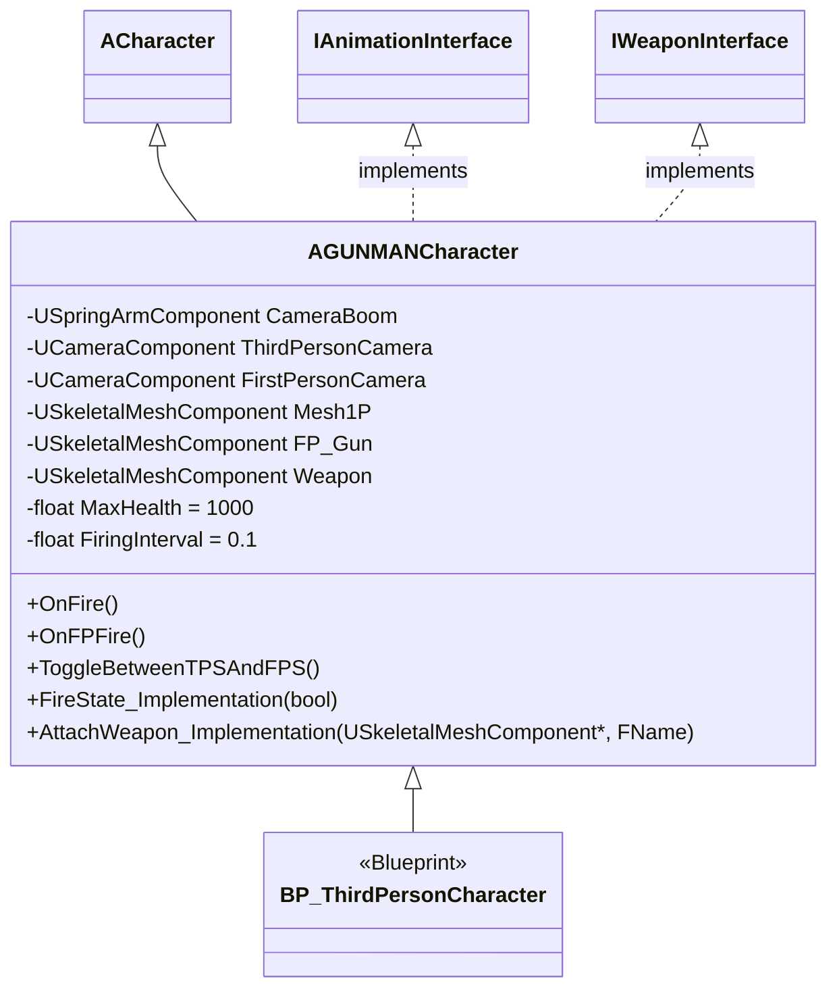

# GUNMANCharacter クラスの説明

## 概要

`AGUNMANCharacter` は `ACharacter` を継承したプレイヤーキャラクタークラスです。  
`IAnimationInterface` と `IWeaponInterface` の 2 つのインターフェースを実装し、  
移動・射撃・視点切り替え・武器管理・ダメージ処理をすべて担当します。

Blueprint クラス `BP_ThirdPersonCharacter` はこのクラスを継承しています。

## クラス図

```mermaid
classDiagram
    ACharacter <|-- AGUNMANCharacter
    IAnimationInterface <|.. AGUNMANCharacter : implements
    IWeaponInterface <|.. AGUNMANCharacter : implements
    AGUNMANCharacter <|-- BP_ThirdPersonCharacter

    class AGUNMANCharacter {
        -USpringArmComponent CameraBoom
        -UCameraComponent ThirdPersonCamera
        -UCameraComponent FirstPersonCamera
        -USkeletalMeshComponent Mesh1P
        -USkeletalMeshComponent FP_Gun
        -USkeletalMeshComponent Weapon
        -float MaxHealth = 1000
        -float FiringInterval = 0.1
        +OnFire()
        +OnFPFire()
        +ToggleBetweenTPSAndFPS()
        +FireState_Implementation(bool)
        +AttachWeapon_Implementation(USkeletalMeshComponent*, FName)
    }
    class BP_ThirdPersonCharacter {
        <<Blueprint>>
    }
```

---

## コンポーネント一覧

| コンポーネント | 型 | 説明 |
|---|---|---|
| `CameraBoom` | `USpringArmComponent` | TPS カメラをキャラクター背後に配置するスプリングアーム（長さ 300）。壁衝突検出あり |
| `ThirdPersonCamera` | `UCameraComponent` | TPS 用カメラ。`CameraBoom` の先端にアタッチ |
| `FirstPersonCamera` | `UCameraComponent` | FPS 用カメラ。カプセルに直接アタッチ、`bUsePawnControlRotation = true` |
| `Mesh1P` | `USkeletalMeshComponent` | FPS 用の腕メッシュ。`SetOnlyOwnerSee(true)` でオーナーにのみ表示 |
| `FP_Gun` | `USkeletalMeshComponent` | FPS 用銃メッシュ。`Mesh1P` の `GripPoint` ソケットにアタッチ（OnConstruction） |
| `FP_MuzzleLocation` | `USceneComponent` | FPS 投射物のスポーン基点 |
| `Weapon` | `USkeletalMeshComponent` | TPS 用武器スロット（常に非表示。実際の武器は `WeaponMeshes` で管理） |
| `StimuliSourceComponent` | `UAIPerceptionStimuliSourceComponent` | 敵 AI がプレイヤーを視覚で感知するための刺激源 |

---

## プロパティ一覧

### カメラ

| プロパティ | 型 | 初期値 | 説明 |
|---|---|---|---|
| `BaseTurnRate` | `float` | 45.0 | 左右視点移動速度（deg/sec） |
| `BaseLookUpRate` | `float` | 45.0 | 上下視点移動速度（deg/sec） |
| `CameraBoomSocketOffset` | `FVector` | — | エイム時のカメラオフセット目標値（エディタで設定） |
| `CameraBoomTargetOffset` | `FVector` | — | カメラブームのターゲットオフセット |

### FPS 専用

| プロパティ | 型 | 初期値 | 説明 |
|---|---|---|---|
| `FP_WeaponATK` | `float` | 5.0 | FPS モードの固定攻撃力 |
| `ProjectileClass` | `TSubclassOf<AFirstPersonProjectile>` | — | FPS 投射物クラス |
| `GunOffset` | `FVector` | (100, 0, 10) | 銃口とキャラクター位置のオフセット |
| `FireAnimation` | `UAnimMontage*` | — | FPS 発射アニメーション |

### TPS 武器

| プロパティ | 型 | 初期値 | 説明 |
|---|---|---|---|
| `WeaponMeshes` | `TArray<USkeletalMeshComponent*>` | — | 所持武器メッシュの配列 |
| `WeaponNumber` | `int` | — | 現在装備中の武器インデックス |
| `WeaponNumberCounter` | `int` | — | 次に装備する武器インデックス（CountWeapon が更新） |
| `EquippedWeapon` | `USkeletalMeshComponent*` | — | 現在装備中の武器メッシュ |
| `EquippedWeaponInfo` | `FWeaponStructure` | — | 現在装備中の武器データ（DataTable から取得） |
| `TP_RifleATK` | `float` | 5.0 | ライフルの攻撃力（WeaponNumber == 0） |
| `TP_ShotgunATK` | `float` | 15.0 | ショットガンの攻撃力（WeaponNumber == 1） |
| `TP_PistolATK` | `float` | 10.0 | ピストルの攻撃力（WeaponNumber その他） |
| `WeaponEmitter` | `UParticleSystem*` | — | 着弾エフェクト |
| `bIsAimingState` | `bool` | false | 現在エイム中か |

### 射撃制御

| プロパティ | 型 | 初期値 | 説明 |
|---|---|---|---|
| `bCanAttack` | `bool` | true | 発砲可能か（AnimNotify が制御） |
| `FiringInterval` | `float` | 0.1 | 連射間隔（秒） |
| `FireTimerHandle` | `FTimerHandle` | — | 連射タイマーのハンドル |
| `bHasArms` | `bool` | false | 武器を装備中か |
| `bIsFP` | `bool` | false | 現在 FPS モードか |
| `bIsFlipped` | `bool` | true | TPS/FPS 切り替えフラグ |

### ゲームプレイ

| プロパティ | 型 | 初期値 | 説明 |
|---|---|---|---|
| `MaxHealth` | `float` | 1000.0 | 最大体力 |
| `CurrentHealth` | `float` | 1000.0 | 現在の体力 |
| `DeadHealth` | `float` | 0.0 | 死亡判定の体力閾値 |
| `KillCount` | `int` | 0 | 倒した敵の数 |

---

## 入力アクション一覧

`LoadEnhancedInput()` でコンストラクタ時にロードされ、`SetupPlayerInputComponent()` でバインドされます。

| InputAction アセット | トリガー | コールバック |
|---|---|---|
| `IA_Jump` | Started / Completed | `StartJump` / `StopJump` |
| `IA_Fire` | Triggered / Completed | `StartFire` / `StopFire` |
| `IA_FPFire` | Triggered / Completed | `StartFPFire` / `StopFPFire` |
| `IA_Toggle` | Triggered | `ToggleBetweenTPSAndFPS` |
| `IA_ReadyGun` | Triggered / Completed | `StartReadyGun` / `StopReadyGun` |
| `IA_SwitchAndEquipWeapons` | Triggered | `AttachingAndRemovingGun` |
| `IA_Run` | Triggered / Completed | `StartTimeline` / `ReverseTimeline` |
| `IA_PauseMenu` | Triggered | `PressedActionPauseMenu` |
| `IA_MoveForward` | Triggered | `MoveForward` |
| `IA_MoveRight` | Triggered | `MoveRight` |
| `IA_Look` | Triggered | `Look` |

---

## 関数の説明

### 初期化

#### `AGUNMANCharacter()` コンストラクタ
カプセルサイズ・カメラ・各メッシュ・武器・AI 刺激源を生成し、`LoadEnhancedInput()` と `CreateTimeline()` を呼び出します。

主な初期値：
- `CameraBoom->TargetArmLength = 300.0f`
- `JumpZVelocity = 600.0f`（StartJump 時に 400.0f に上書き）
- `bOrientRotationToMovement = true`

#### `LoadEnhancedInput()`
`ConstructorHelpers::FObjectFinder` で `IMC_Default` および 11 個の `InputAction`・`DT_Weapon` DataTable をロードし、各メンバー変数に代入します。コンストラクタからのみ呼ばれます。

#### `BeginPlay()`
1. `DefaultMappingContext` を `EnhancedInputLocalPlayerSubsystem` に登録
2. マウスカーソルを非表示にし入力モードをゲームのみに設定
3. `DisplayCharacterUI` / `DisplayGunSight` で UI を生成
4. `TPMeshAnimInstance` を取得
5. `ToggleFlipflop(true, false)` で初期状態を TPS に設定
6. `OnTakeAnyDamage` に `HandleAnyDamage` をバインド

#### `OnConstruction(const FTransform&)`
`FP_Gun` を `Mesh1P` の `GripPoint` ソケットに `SnapToTarget` でアタッチします。ゲームプレイ中ではなくエディタ上でも実行されます。

#### `Tick(float DeltaTime)`
1. `RunTimeline` が再生中なら `TickTimeline(DeltaTime)` を呼ぶ
2. `ChangeCameraOffset(DeltaTime)` でカメラオフセットを補間

---

### カメラ・視点

#### `ChangeCameraOffset(float& DeltaTime)`
TPS モード時に毎フレーム呼ばれ、カメラブームのオフセットを `FMath::Lerp` で補間します。  
FPS モード中（`bIsFP == true`）は即座に return します。

キャラクター前方へ短い LineTrace を行い、3 つの状態を判定します：

| 状態 | 条件 | TargetArmLength | SocketOffset |
|---|---|---|---|
| 壁衝突 | `HitResult.bBlockingHit` | → 100 | → (0, 0, 60) |
| エイム中 | `bIsAimingState` | → 300 | → `CameraBoomSocketOffset` |
| 通常 | それ以外 | → 300 | 変更なし |

#### `ToggleBetweenTPSAndFPS()`
`bIsFlipped` を確認してフラグを反転させながら `ToggleFlipflop` を呼び出します。  
TPS → FPS 遷移時は照準 UI を非表示にします。  
FPS → TPS 遷移時は武器装備かつエイム中の場合のみ照準 UI を再表示します。

#### `ToggleFlipflop(bool bIsTPActive, bool bIsFPActive)`
カメラ・メッシュ・武器の表示を切り替えます：
- `ThirdPersonCamera` / `FirstPersonCamera` のアクティブ状態を切り替え
- `bUseControllerRotationYaw` を FPS 時のみ `true` に
- TPS メッシュ（`GetMesh()`）、FPS メッシュ（`Mesh1P` / `FP_Gun`）の表示切り替え
- シーン内のすべての `AWeapon` アクターを検索し、TPS 時のみ表示
- `bIsFP` フラグを更新

---

### 射撃

#### `StartFire()` / `StopFire()`
`FTimerManager` に `FiringInterval`（0.1 秒）間隔で `FiringEvent` を呼ぶタイマーを設定・解除します。

#### `FiringEvent()`
`bHasArms && bIsAimingState && bCanAttack && !bIsFP` の条件をすべて満たす場合に `OnFire()` を実行します。

#### `StartFPFire()` / `StopFPFire()`
同様に `FiringInterval` 間隔で `FPFiringEvent` を呼ぶタイマーを設定・解除します。

#### `FPFiringEvent()`
`bIsFP` が true のときのみ `OnFPFire()` を実行します。

#### `PerformEnemyLineTrace(FHitResult& OutHit) const`
`ThirdPersonCamera` の位置から前方 10,000 ユニットへ `ECC_Visibility` でライントレースを行います。自分自身はトレース対象から除外します。TPS・FPS 両方の発射処理から共通で使用されます。

#### `OnFire()`
TPS モードの発射処理です：
1. `AnimationAtFiring()` でエフェクト・アニメーションを再生
2. `PerformEnemyLineTrace` でヒット判定
3. ヒットした敵が `AAIEnemy` かつ生存中なら着弾エフェクトをスポーン
4. `WeaponNumber` に応じた攻撃力（下表）で `UGameplayStatics::ApplyDamage` を適用
5. 撃破した場合は `KillCount` をインクリメント

| WeaponNumber | 武器 | 攻撃力 |
|---|---|---|
| 0 | ライフル | 5.0 |
| 1 | ショットガン | 15.0 |
| その他 | ピストル | 10.0 |

#### `OnFPFire()`
FPS モードの発射処理です。`PerformEnemyLineTrace` でヒット判定後、固定値 `FP_WeaponATK = 5.0` でダメージを適用します。撃破で `KillCount` をインクリメントします。

#### `AnimationAtFiring()`
`bIsFP` の状態で処理を分岐します：

| モード | 処理内容 |
|---|---|
| FPS | `FireSound` を再生、`Mesh1P` のアニメーションモンタージュを再生、`FP_MuzzleLocation` から `AFirstPersonProjectile` をスポーン |
| TPS | `EquippedWeaponInfo.GunshotSound` を再生、マズルフラッシュをアタッチ、`FiringMontage` を再生、薬莢（`AWeaponAmmunition`）をスポーン |

---

### エイム

#### `StartReadyGun()`
`bHasArms && !bIsFP` の場合のみ有効です。  
`CameraBoom->SocketOffset` をエイム用オフセットに設定し、`GunPreparationProcess(true, false, true)` を呼んで照準 UI を表示します。

#### `StopReadyGun()`
`bHasArms && !bIsFP` の場合のみ有効です。  
`CameraBoom->SocketOffset` をゼロベクトルに戻し、`GunPreparationProcess(false, true, false)` を呼んで照準 UI を非表示にします。

#### `GunPreparationProcess(bool bIsAiming, bool bOrientRotationToMovement, bool bYawRotation)`
エイム状態の内部処理です：
1. `bIsAimingState` を更新
2. `IAnimationInterface::AimingState` でアニメーションインスタンスに通知
3. `bOrientRotationToMovement` と `bUseControllerRotationYaw` を更新

---

### 武器管理

#### `AttachingAndRemovingGun()`
FPS モード中は何もしません。武器の装備状態をトグルします：
- **未装備時**: `WeaponMeshes[WeaponNumber]` を表示し、DataTable から `FWeaponStructure` を取得して `EquipWeapon()` を呼ぶ。装備音を再生し `CountWeapon()` で次のインデックスを記録
- **装備済み時**: `RemoveWeapon()` で現在の武器メッシュを取得し、DataTable のホルスターソケットに戻す

#### `EquipWeapon(bool bHasWeapon, bool bHasPistol, FName SoketName)`
武器メッシュを指定ソケットにアタッチし、`bHasArms` を更新します。  
`IAnimationInterface::EquippedState` でアニメーションインスタンスに装備状態を通知します。

#### `CountWeapon(TArray<USkeletalMeshComponent*> Arms, int Number)`
次に装備する武器のインデックスを `WeaponNumberCounter` に記録します。  
`Number + 1 < Arms.Num()` なら `Number + 1`、そうでなければ `0`（先頭に折り返し）。

#### `RemoveWeapon(TArray<USkeletalMeshComponent*> Arms, int Number)`
現在装備中の武器メッシュを返します。`Number`（= `WeaponNumberCounter`）は既に次のインデックスを指しているため、`Number - 1` の武器が装備中です。`Number == 0` の場合は配列末尾を返します。

#### `AttachWeapon_Implementation(USkeletalMeshComponent* WeaponMesh, FName AttachSoketName)`
`IWeaponInterface` の実装です。レベルに配置された `AWeapon` アクターの `BeginPlay` から呼ばれます。  
`WeaponMeshes` 配列に `WeaponMesh` を追加し、指定ソケットにアタッチします。

---

### 移動・入力

#### `MoveForward(const FInputActionValue& Value)`
コントローラーの Yaw 回転から前方ベクトルを算出し、正（前進）/ 負（後退）で `AddMovementInput` を呼びます。

#### `MoveRight(const FInputActionValue& Value)`
コントローラーの Yaw 回転から右方向ベクトルを算出し、`AddMovementInput` を呼びます。

#### `Look(const FInputActionValue& Value)`
2D 入力の X 軸を `AddControllerYawInput`（水平）、Y 軸を `AddControllerPitchInput`（垂直）に割り当てます。

#### `StartJump()`
`Jump()` を呼び、`JumpZVelocity` を 400.0f に設定します。

#### `StopJump()`
`StopJumping()` を呼び、`JumpButtonDown` をリセットし `JumpZVelocity` を 400.0f に戻します。

#### `PressedActionPauseMenu()`
現在のレベルスクリプトを `ABattleMapScript` にキャストし、成功した場合のみ実行します：
1. `DefaultMappingContext` をサブシステムから削除
2. `BattleMapScript->PauseMenuMappingContext` を追加（ポーズメニュー専用入力に切り替え）
3. `BattleMapScript->InitializeButtonPosition()` でポーズメニューを表示

バトルマップ以外ではキャストが失敗するため何もしません。

---

### ダメージ処理

#### `HandleAnyDamage()`
`OnTakeAnyDamage` デリゲートのコールバックです。`CurrentHealth -= Damage` を行い、`CurrentHealth <= 0` になると `UGameplayStatics::OpenLevel` で `GameOverMap` へ遷移します。

---

### タイムライン

#### `CreateTimeline()`
`CB_Run` カーブをロードし、長さ 1 秒のタイムラインを初期化します。`Timeline_LinearInterpCharacterSpeed` をフレームコールバックとして登録します。コンストラクタからのみ呼ばれます。

#### `Timeline_LinearInterpCharacterSpeed(float Value)`
カーブの現在値をそのまま `CharacterMovement->MaxWalkSpeed` に代入します。

#### `StartTimeline()` / `ReverseTimeline()`
タイムラインを先頭から再生（加速）/ 末尾から逆再生（減速）します。  
`IA_Run` の Triggered / Completed にそれぞれバインドされています。

---

### UI

#### `DisplayGunSight(TObjectPtr<APlayerController>& PlayerController)`
`WBP_UIGunSight` から `UIGunSightRef` を生成します。ビューポートへの追加はここでは行わず、エイム時に `StartReadyGun` / `ToggleBetweenTPSAndFPS` が制御します。

#### `DisplayCharacterUI(TObjectPtr<APlayerController>& PlayerController)`
`WBP_UICharacter` を生成してビューポートに追加します（BeginPlay 時に一度だけ呼ばれます）。

---

### Getter

| 関数 | 戻り値 | 説明 |
|---|---|---|
| `GetKillCount()` | `int` | 撃破数 `KillCount` を返す |
| `CalcHealthPercent()` | `float` | `CurrentHealth / MaxHealth` を返す（UI の体力バーが使用） |
