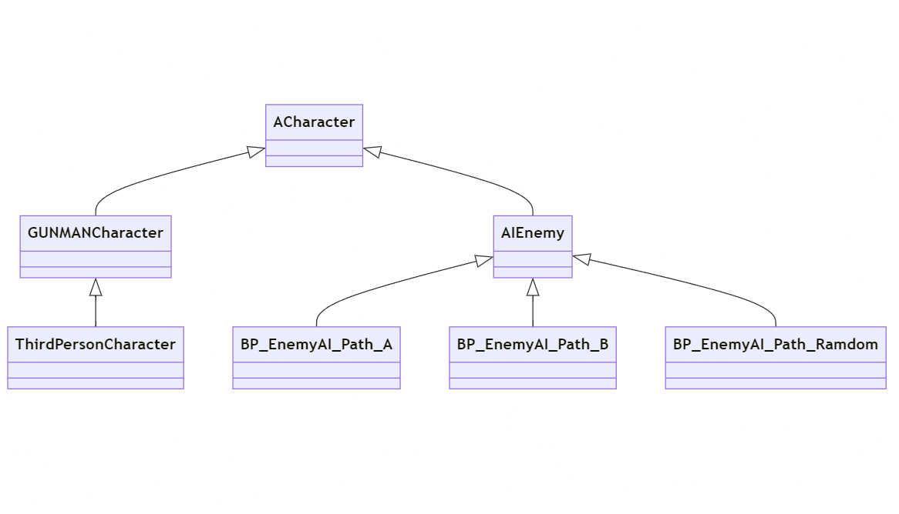

# AIEnemy クラスの概要

## 主な処理内容

**AIEnemyクラス**は `ACharacter` クラスを継承した**敵AIクラス**です。  
このクラスを継承した Blueprint が 3 つあり、巡回する敵とランダムに動く敵がいます。  

このクラスは以下の要素を含んでいます。

- **Tick関数の設定**：毎フレーム処理を行うためにTickを有効にしています。
- **コンポーネントの作成**：敵の武器やウィジェット（HPバーなど）のコンポーネントを定義・アタッチしています。
- **プロパティの設定**：敵の体力、攻撃力、武器の情報を格納するためのプロパティが定義されています。
- **Timelineの設定**：`FTimeline`を使用して、敵の動きを滑らかに制御しています。
- **ダメージ処理**：ダメージを受けたときの体力の減少や死亡後の処理を管理し、プレイヤーにダメージを与える処理も定義しています。

## このクラスのソースコードの説明

### コンストラクター (`AAIEnemy::AAIEnemy`)

- `PrimaryActorTick.bCanEverTick = true;`  
  毎フレームTickを呼び出す設定。

- `AIControllerClass = AAIEnemyController::StaticClass();`  
  AIコントローラークラスを指定。

- **コンポーネント作成**  
  - `Weapon`：武器用のスケルタルメッシュを作成し、キャラクターメッシュにアタッチ。
  - `Widget`：HPバー等のウィジェットを作成し、キャラクターメッシュにアタッチ。

- **データテーブルのロード**  
  `DT_Weapon`というデータテーブルから武器情報を取得。

- **タイムライン設定**  
  `RunTimeline`を初期化し、`FloatCurve`を使ってスムーズな移動速度の変化を制御。

- **プロパティの初期化**  
  敵の体力や攻撃力、死亡時の処理に関連するプロパティを初期化。

### `BeginPlay` 関数

- ゲーム開始時に呼ばれる関数。
- プレイヤーキャラクターを取得し、敵AIコントローラーを設定。
- ダメージを受けたときの処理を`OnTakeAnyDamage`デリゲートにバインド。
- 武器のデータをデータテーブルから取得し、キャラクターメッシュにアタッチ。

### `Tick` 関数

- 毎フレーム呼び出される処理ですが、このクラスでは特に何もしていません（基本的な処理のみ）。

### `AttackCharacter_Implementation` 関数

- 敵が攻撃を行う際の処理。
  - 武器データをデータテーブルから取得し、効果音を再生。
  - 発砲アニメーションを再生し、銃口エフェクトを生成。
  - 弾薬を生成し、`CreateAmmunition()`で弾道をシミュレーション。

### `CreateAmmunition` 関数

- 弾薬の生成と、プレイヤーに命中した場合のダメージ処理。
- `LineTraceSingle()`を使用して弾道の判定を行い、命中時にダメージを与えます。

### `HandleAnyDamage` 関数

- 敵がダメージを受けた際の処理。
  - 体力が減少し、体力が0以下になると死亡処理を実行。
  - 死亡時には移動を無効化し、物理シミュレーションをオンにしてキャラクターが倒れる動作を実現。

### `TimeLineFunc` 関数

- タイムラインの更新時に呼ばれる関数。`FInterpTo`を使って移動速度を滑らかに変化させています。

### `ChangeRunningSpeed_Implementation` 関数

- タイムラインを再生し、指定したスピードに敵の移動速度を変更します。

### `Getter` 関数

- `GetCurrentHealth()`：現在の体力を返します。
- `GetHealthPercent()`：体力の割合を返します。