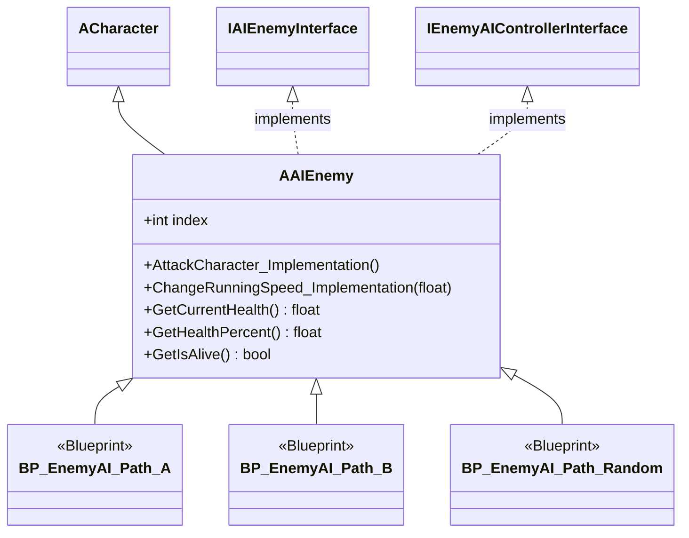
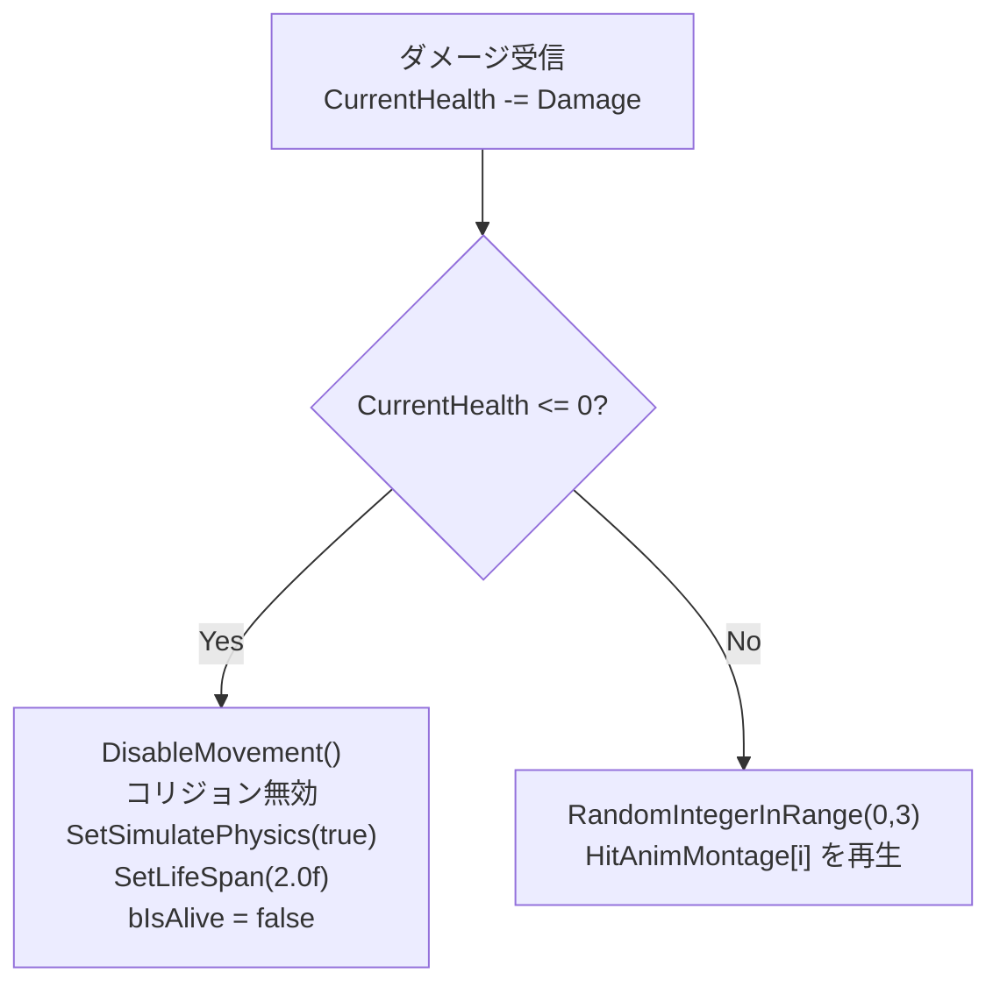

# AIEnemy クラスの概要

ソースコード: `Source/GUNMAN/Enemy/AIEnemy.h / .cpp`

## 概要

`AAIEnemy` は `ACharacter` を継承した敵キャラクタークラスです。  
`IAIEnemyInterface` と `IEnemyAIControllerInterface` の 2 つのインターフェースを実装します。

このクラスを継承した Blueprint が 3 種類あり、タグで巡回パターンを切り替えます。

| Blueprint | タグ | 巡回パターン |
|---|---|---|
| `BP_EnemyAI_Path_A` | `PathA` | 巡回路 A を回る |
| `BP_EnemyAI_Path_B` | `PathB` | 巡回路 B を回る |
| `BP_EnemyAI_Path_Random` | `Random` | ランダムに移動 |

## クラス図


```mermaid
classDiagram
    ACharacter <|-- AAIEnemy
    IAIEnemyInterface <|.. AAIEnemy : implements
    IEnemyAIControllerInterface <|.. AAIEnemy : implements
    AAIEnemy <|-- BP_EnemyAI_Path_A
    AAIEnemy <|-- BP_EnemyAI_Path_B
    AAIEnemy <|-- BP_EnemyAI_Path_Random

    class AAIEnemy {
        +int index
        +AttackCharacter_Implementation()
        +ChangeRunningSpeed_Implementation(float)
        +GetCurrentHealth() float
        +GetHealthPercent() float
        +GetIsAlive() bool
    }
    class BP_EnemyAI_Path_A { <<Blueprint>> }
    class BP_EnemyAI_Path_B { <<Blueprint>> }
    class BP_EnemyAI_Path_Random { <<Blueprint>> }
```

---

## コンポーネント一覧

| コンポーネント | 型 | 説明 |
|---|---|---|
| `Weapon` | `USkeletalMeshComponent` | 武器メッシュ。`GetMesh()` の子コンポーネント |
| `Widget` | `UWidgetComponent` | 頭上 HP バー表示用。`GetMesh()` の子コンポーネント |

---

## プロパティ一覧

| プロパティ | 型 | 初期値 | 説明 |
|---|---|---|---|
| `CurrentHealth` | `float` | 30.0 | 現在の体力 |
| `MaxHealth` | `float` | 30.0 | 最大体力（`CurrentHealth` と同値で初期化） |
| `DeadHealth` | `float` | 0.0 | 死亡判定の体力閾値 |
| `EnemyATK` | `float` | 10.0 | プレイヤーに与えるダメージ |
| `InLifeSpan` | `float` | 2.0 | 死亡後に Destroy されるまでの秒数 |
| `bIsAlive` | `bool` | true | 生存フラグ（死亡時に `false` になる） |
| `HitAnimMontage` | `TArray<UAnimMontage*>` | — | 被弾アニメーション配列（4 要素、ランダム再生） |
| `index` | `int` | 0 | `BTT_TaskPath` が参照する巡回インデックス（各敵が個別に保持） |

---

## 関数の説明

### `AAIEnemy()` コンストラクタ

主な初期化：
- `AutoPossessAI = EAutoPossessAI::PlacedInWorldOrSpawned` — レベル配置・スポーン生成どちらにも AI を適用
- `Weapon` / `Widget` を `GetMesh()` の子として生成
- `DT_Weapon` DataTable をロード
- `CB_EnemyRun` カーブから `FTimeline*` を heap 生成し、長さ 1 秒で初期化
- `CurrentHealth = 30.0f`, `MaxHealth = CurrentHealth`, `EnemyATK = 10.0f`, `InLifeSpan = 2.0f`

> **`PlacedInWorldOrSpawned` について**  
> デフォルトの `PlacedInWorld` ではスポーン生成された敵に AI が適用されませんでした。  
> `PlacedInWorldOrSpawned` に変更することで、`EnemyTargetPoint` から動的に生成された敵にも正しく AI が付くようになりました（[AppealPoint.md](../AppealPoint.md) 参照）。

### `BeginPlay()`

1. `UGameplayStatics::GetPlayerCharacter` でプレイヤー参照を取得
2. `OnTakeAnyDamage` に `HandleAnyDamage` をバインド
3. `Widget->GetUserWidgetObject()` から `UUIEnemy` を取得し、`SetOwningEnemy(this)` で自身を渡す
4. DataTable の `"Rifle"` 行を参照し、武器を `EquipSocketName` ソケットにアタッチ

### `AttackCharacter_Implementation()`

`bIsAlive` が `true` の場合のみ実行されます：

1. DataTable の `"Rifle"` 行から `EquippedWeaponInformation` を更新
2. 発射 SE を再生（`PlaySound2D`）
3. 発射アニメーションモンタージュを再生（`PlayAnimMontage`、再生速度 0.1）
4. マズルフラッシュをアタッチ（`SpawnEmitterAttached`）
5. `CreateAmmunition()` でライントレース判定

### `CreateAmmunition()`

銃口から前方 10,000 ユニットへ `ECC_Visibility` でライントレースを実行し、ヒットしたアクターがプレイヤーであれば `EnemyATK`（10.0）のダメージを適用します。

```
銃口位置 (AmmunitionSocketName) → 前方 10,000 units → LineTrace
    ↓ ヒット & Player だった場合
UGameplayStatics::ApplyDamage(Player, 10.0f)
```

薬莢アクター（`AmmunitionClass`）はマズルソケット位置にスポーンされます。

### `HandleAnyDamage()`

`OnTakeAnyDamage` デリゲートのコールバックです。


```mermaid
flowchart TD
    D["ダメージ受信\nCurrentHealth -= Damage"]
    D --> C{CurrentHealth <= 0?}
    C -- Yes --> E["DisableMovement()\nコリジョン無効\nSetSimulatePhysics(true)\nSetLifeSpan(2.0f)\nbIsAlive = false"]
    C -- No --> H["RandomIntegerInRange(0,3)\nHitAnimMontage[i] を再生"]
```

- 死亡時は物理シミュレーションをオンにしてラグドール状態にし、2 秒後に自動 Destroy
- 生存時は 4 種類の被弾モンタージュからランダムに 1 つ再生

### `TimeLineFunc(float Value)`

タイムラインのフレームコールバックです。`FMath::FInterpTo` で `MaxWalkSpeed` を `EnemySpeed` に向けて補間（補間速度 5.0）します。

### `ChangeRunningSpeed_Implementation(float Speed)`

`IAIEnemyInterface::ChangeRunningSpeed` の実装です。`EnemySpeed = Speed` に設定した後、`RunTimeline->PlayFromStart()` でタイムラインを再生して速度補間を開始します。

### Getter

| 関数 | 戻り値 | 説明 |
|---|---|---|
| `GetCurrentHealth()` | `float` | 現在の体力 |
| `GetHealthPercent()` | `float` | `CurrentHealth / MaxHealth`（UI の HP バーが使用） |
| `GetIsAlive()` | `bool` | 生存フラグ `bIsAlive` を返す |
