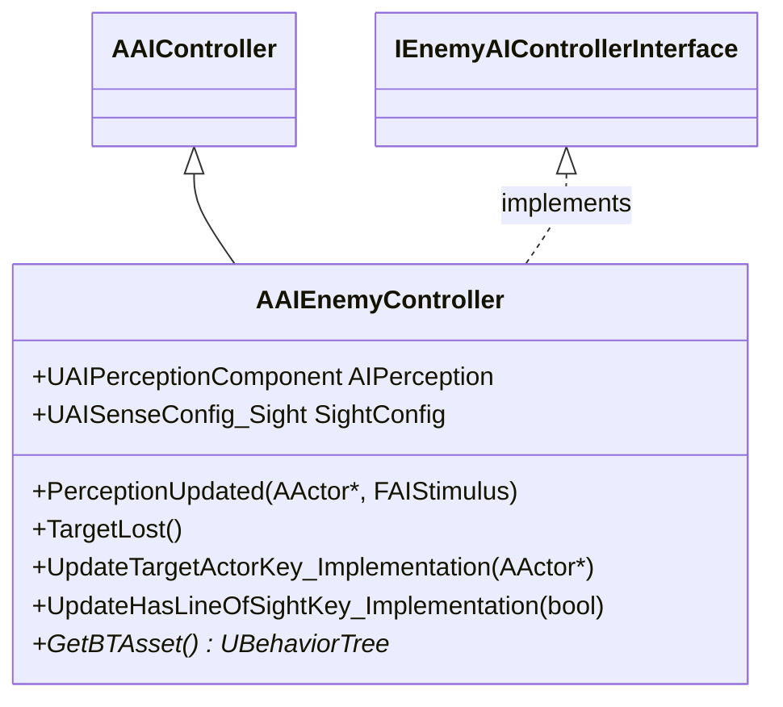

# AIEnemyController クラスの概要

ソースコード: `Source/GUNMAN/Enemy/AIEnemyController.h / .cpp`

## 概要

`AAIEnemyController` は `AAIController` を継承し、`IEnemyAIControllerInterface` を実装する敵 AI コントローラーです。  
`AI Perception`（視覚）でプレイヤーを検知し、Blackboard を更新することで `BT_PatrolAI` の動作を切り替えます。

## クラス図



---

## 視覚センサー設定値

コンストラクタで `UAISenseConfig_Sight` に以下の値を設定します。

| パラメータ | 値 | 説明 |
|---|---|---|
| `SightRadius` | 500.0 | 視界範囲（半径 cm） |
| `LoseSightRadius` | 550.0 | 視界を失う距離（SightRadius + 50） |
| `PeripheralVisionAngleDegrees` | 90.0 | 周辺視野角（片側 90°） |
| `MaxAge` | 5.0 | 刺激情報の最大保持時間（秒） |
| `bDetectEnemies / Neutrals / Friendlies` | すべて true | 全 Affiliation を検知対象にする |

---

## Blackboard キー一覧

| キー名 | 型 | 説明 |
|---|---|---|
| `"TargetActor"` | Object | 追跡対象のアクター（プレイヤー or null） |
| `"HasLIneOfSight"` | bool | 視界内にターゲットがいるか（※ソース上のスペルミス "LIne"） |

---

## 関数の説明

### `AAIEnemyController()` コンストラクタ

1. `UAIPerceptionComponent` を生成し `SetPerceptionComponent` で登録
2. `UAISenseConfig_Sight` を生成して上表の値を設定し `ConfigureSense` に追加
3. `OnTargetPerceptionUpdated` に `PerceptionUpdated` をバインド
4. `BT_PatrolAI` をロード

### `BeginPlay()`

`RunBehaviorTree(BTAsset)` で `BT_PatrolAI` を起動します。

### `PerceptionUpdated(AActor* Actor, FAIStimulus Stimulus)`

`OnTargetPerceptionUpdated` のコールバックです。

```mermaid
flowchart TD
    A["PerceptionUpdated 呼び出し"]
    A --> B{受信アクターがプレイヤーか？}
    B -- No --> Z["何もしない"]
    B -- Yes --> C{Stimulus.WasSuccessfullySensed()\n&&\nEnemyActor->GetIsAlive()?}
    C -- Yes --> D["タイマーをリセット\nUpdateTargetActorKey(Player)\nUpdateHasLineOfSightKey(true)"]
    C -- No --> E["SetTimer(5.0s) → TargetLost()\nUpdateHasLineOfSightKey(false)"]
```

- 視界に入った場合：Blackboard の `TargetActor` にプレイヤーをセットし、`HasLIneOfSight` を `true` に
- 視界から外れた場合：5 秒後に `TargetLost()` を呼ぶタイマーをセットし、`HasLIneOfSight` を `false` に

### `TargetLost()`

タイマーのコールバックです。`UpdateTargetActorKey_Implementation(nullptr)` を呼び、Blackboard の `TargetActor` を null にして追跡を解除します。

### `UpdateTargetActorKey_Implementation(AActor* TargetActor)`

`IEnemyAIControllerInterface::UpdateTargetActorKey` の実装です。  
`BlackboardComponent->SetValueAsObject("TargetActor", TargetActor)` で追跡対象を更新します。

### `UpdateHasLineOfSightKey_Implementation(bool HasLineOfSight)`

`IEnemyAIControllerInterface::UpdateHasLineOfSightKey` の実装です。  
`BlackboardComponent->SetValueAsBool("HasLIneOfSight", HasLineOfSight)` で視界フラグを更新します。
