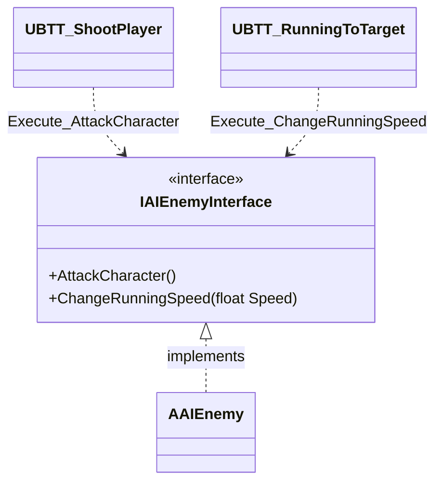

# AIEnemyInterface クラスの概要

ソースコード: `Source/GUNMAN/Enemy/AIEnemyInterface.h / .cpp`

## 概要

`IAIEnemyInterface` は敵キャラクターへの命令を抽象化するインターフェースです。  
`BlueprintNativeEvent` として宣言されており、C++ と Blueprint の両方で実装できます。  
`AAIEnemy` が実装し、Behavior Tree タスクから呼び出されます。

## クラス図

## 関数の説明

### `AttackCharacter()`

敵が攻撃を実行するための関数です。  
`UBTT_ShootPlayer::ExecuteTask` から `Execute_AttackCharacter(Enemy)` として呼ばれます。  
実装クラス `AAIEnemy::AttackCharacter_Implementation` で発射 SE・アニメーション・ライントレース判定を行います。

### `ChangeRunningSpeed(float Speed)`

敵の移動速度を変更するための関数です。  
`UBTT_RunningToTarget::ExecuteTask` から `Execute_ChangeRunningSpeed(Enemy, RunningSpeed)` として呼ばれます。  
実装クラス `AAIEnemy::ChangeRunningSpeed_Implementation` で Timeline を再生し速度を補間します。
