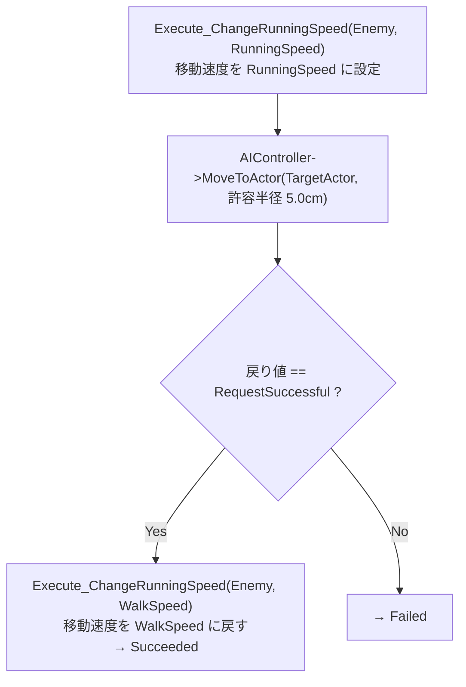

# BTT_RunningToTarget クラスの概要

ソースコード: `Source/GUNMAN/Enemy/BehaviorTree/Tasks/BTT_RunningToTarget.h / .cpp`

## 概要

`UBTT_RunningToTarget` は `UBTTask_BlackboardBase` を継承した追跡タスクです。  
Behavior Tree エディタ上の表示名は **"RunningToTarget"** です。

`IAIEnemyInterface::ChangeRunningSpeed` で移動速度を上げてからプレイヤーへ追跡を開始し、到達後または BT から中断された際に速度をウォーク速度に戻します。

## プロパティ

| プロパティ | 型 | 説明 |
|---|---|---|
| `RunningSpeed` | `float` | 追跡時の移動速度（エディタで設定） |
| `WalkSpeed` | `float` | 通常時の移動速度（エディタで設定） |
| `TargetActorKey` | `FBlackboardKeySelector` | Blackboard 上の追跡対象アクターキー |

## 関数の説明

### `ExecuteTask(UBehaviorTreeComponent&, uint8*)`

1. `ChangeRunningSpeed(RunningSpeed)` でダッシュ速度にする
2. `MoveToActor` でプレイヤーへ経路探索を開始（許容半径 5.0 cm）
3. `MoveToActor` が `RequestSuccessful` を返せば速度をリセットして成功
4. 経路が見つからない場合は失敗

> **5 秒タイマーはありません**  
> 一定時間で中断する処理はこのタスク自体には実装されていません。  
> BT 側のデコレーター（`BTD_FarFromTarget` など）の条件変化によって `AbortTask` が呼ばれます。

### `AbortTask(UBehaviorTreeComponent&, uint8*)`

BT フレームワークからタスクが中断された際に呼ばれます。  
`ChangeRunningSpeed(WalkSpeed)` で速度をウォーク速度に戻し、`FinishLatentAbort` で中断完了を報告します。
