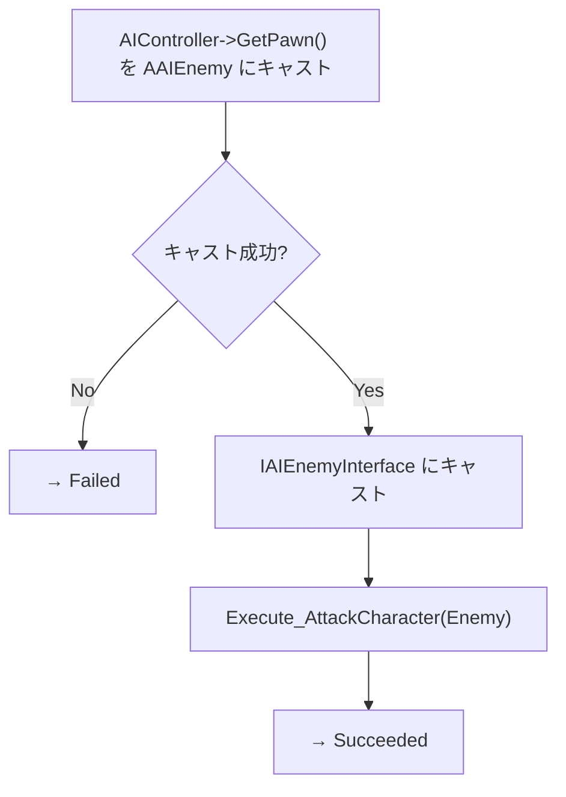

# BTT_ShootPlayer クラスの概要

ソースコード: `Source/GUNMAN/Enemy/BehaviorTree/Tasks/BTT_ShootPlayer.h / .cpp`

## 概要

`UBTT_ShootPlayer` は `UBTTask_BlackboardBase` を継承した攻撃タスクです。  
Behavior Tree エディタ上の表示名は **"ShootPlayer"** です。

`IAIEnemyInterface::AttackCharacter` 経由で敵に攻撃を実行させます。  
Blackboard キーは使用しません。

## 関数の説明

### `UBTT_ShootPlayer()` コンストラクタ

`NodeName = "ShootPlayer"` を設定するのみです。

### `ExecuteTask(UBehaviorTreeComponent&, uint8*)`

1. `OwnerComp.GetAIOwner()` でコントローラーを取得
2. 操作中のポーンを `AAIEnemy` にキャスト
3. `IAIEnemyInterface::Execute_AttackCharacter(Enemy)` を呼び出す
4. `AAIEnemy::AttackCharacter_Implementation` が発射 SE・アニメーション・ライントレースを実行
