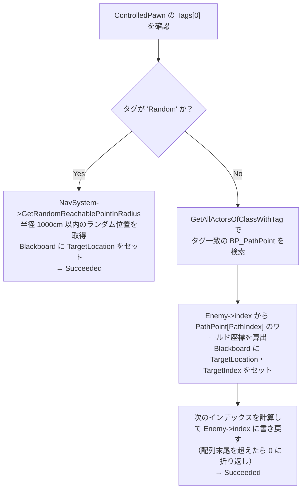

# BTT_TaskPath クラスの概要

ソースコード: `Source/GUNMAN/Enemy/BehaviorTree/Tasks/BTT_TaskPath.h / .cpp`

## 概要

`UBTT_TaskPath` は `UBTTask_BlackboardBase` を継承した巡回タスクです。  
Behavior Tree エディタ上の表示名は **"TaskPath"** です。

敵のタグを見て巡回方式を分岐します：

| タグ | 動作 |
|---|---|
| `Random` | `UNavigationSystemV1` で半径 1,000 cm（10 m）以内のランダム位置に移動 |
| `PathA` / `PathB` | タグ一致の `BP_PathPoint` から座標を取得し、順番に巡回 |

## プロパティ

| プロパティ | 型 | 説明 |
|---|---|---|
| `TargetLocationKey` | `FBlackboardKeySelector` | 移動先の座標をセットする Blackboard キー |
| `TargetIndexKey` | `FBlackboardKeySelector` | 現在の巡回インデックスをセットする Blackboard キー |
| `something_object` | `TSubclassOf<APathPoint>` | `BP_PathPoint` の Blueprint クラス参照（コンストラクタでロード） |

## 関数の説明

### `UBTT_TaskPath()` コンストラクタ

`ConstructorHelpers::FObjectFinder` で `BP_PathPoint` Blueprint クラスをロードし `something_object` に代入します。

### `ExecuteTask(UBehaviorTreeComponent&, uint8*)`

**インデックス管理について**  
巡回インデックスは `Enemy->index`（`AAIEnemy` のメンバー変数）で管理しています。  
タスクインスタンスは複数の敵で共有されますが、インデックスを各敵側に持たせることで  
複数の敵が同じルートを巡回しても順序が乱れません（[AppealPoint.md](../../AppealPoint.md) 参照）。

### `SelectInt(bool bCondition, int OptionA, int OptionB)`

`bCondition` が true なら `OptionA`、false なら `OptionB` を返すユーティリティ関数です。  
インデックスの折り返し判定に使用します。
