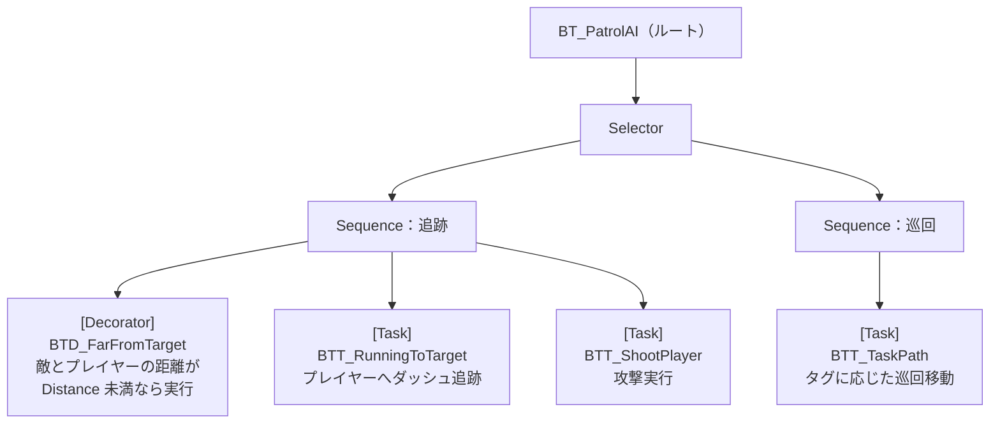

# GUNMAN - Behavior Tree

ソースコードの対応場所:  
- `Source/GUNMAN/Enemy/BehaviorTree/Decorators/`  
- `Source/GUNMAN/Enemy/BehaviorTree/Tasks/`

敵 AI の行動を制御する Behavior Tree（`BT_PatrolAI`）で使用するカスタムタスク・デコレーターです。

## BT_PatrolAI の構成

## ファイル一覧

| ファイル | 種別 | 概要 |
|---|---|---|
| [BTD_FarFromTarget](BTD_FarFromTarget.md) | Decorator | 敵とプレイヤーの距離を判定し、巡回と追跡のブランチを切り替える |
| [BTT_TaskPath](BTT_TaskPath.md) | Task | タグ（PathA / PathB / Random）に応じた巡回移動を実行する |
| [BTT_RunningToTarget](BTT_RunningToTarget.md) | Task | プレイヤーへダッシュ追跡。到達または中断時に速度をリセット |
| [BTT_ShootPlayer](BTT_ShootPlayer.md) | Task | `IAIEnemyInterface` 経由で敵に攻撃を実行させる |
