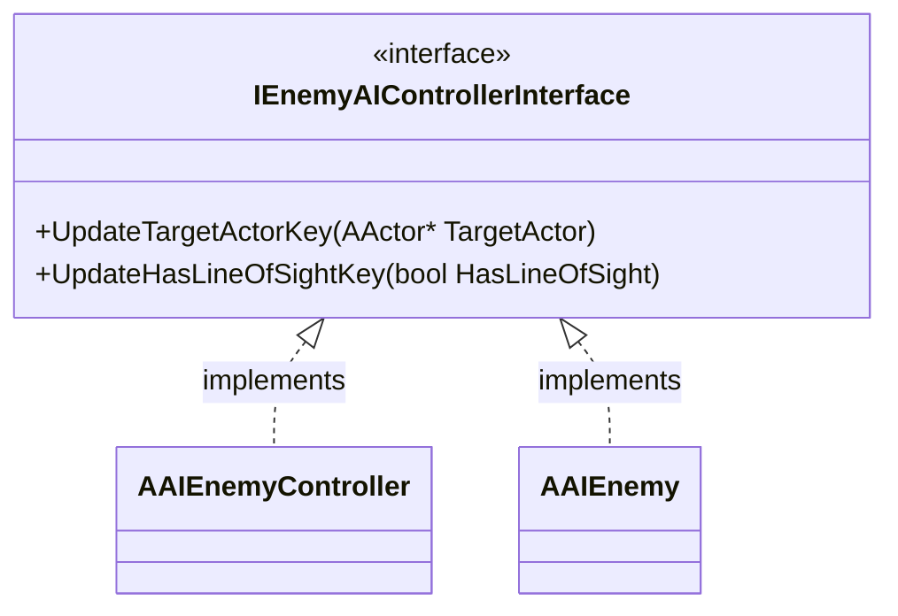

# EnemyAIControllerInterface クラスの概要

ソースコード: `Source/GUNMAN/Enemy/EnemyAIControllerInterface.h / .cpp`

## 概要

`IEnemyAIControllerInterface` は AI コントローラーへの Blackboard 更新命令を抽象化するインターフェースです。  
`BlueprintNativeEvent` として宣言されており、C++ と Blueprint の両方で実装できます。  
`AAIEnemyController` と `AAIEnemy` の両方が実装します。

## クラス図

## 関数の説明

### `UpdateTargetActorKey(AActor* TargetActor)`

追跡対象のアクターを Blackboard キー `"TargetActor"` に設定します。  
`AAIEnemyController::PerceptionUpdated` でプレイヤーを検知したときに呼ばれます。  
`TargetLost` から `nullptr` を渡すことで追跡を解除します。

### `UpdateHasLineOfSightKey(bool HasLineOfSight)`

視界内にターゲットがいるかを Blackboard キー `"HasLIneOfSight"` に設定します（※ソース上のスペルミス "LIne"）。  
`AAIEnemyController::PerceptionUpdated` でプレイヤーの視界状態が変化したときに呼ばれます。
