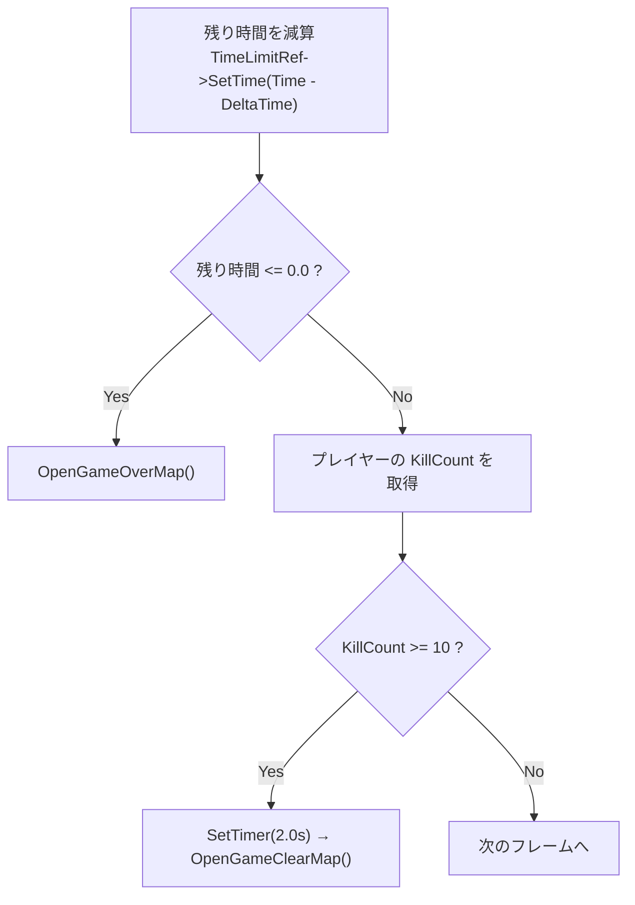

# GUNMANGameMode クラスの概要

ソースコード: `Source/GUNMAN/GameModes/GUNMANGameMode.h / .cpp`

## 概要

`AGUNMANGameMode` は `AGUNMANGameModeBase` を継承した**バトルマップ専用の GameMode** です。  
制限時間の管理・クリア/オーバー判定・シーン遷移の 3 つを担います。

> プレイヤーの体力が 0 になったときのゲームオーバー遷移は `GUNMANCharacter::HandleAnyDamage` が処理します。

## プロパティ一覧

| プロパティ | 型 | 初期値 | 説明 |
|---|---|---|---|
| `GameClearKillCount` | `int` | 10 | ゲームクリアに必要な撃破数 |
| `GameOverTime` | `float` | 0.0 | 残り時間がこの値以下になるとゲームオーバー |
| `GameClearWaitingTime` | `float` | 2.0 | クリア判定後、シーン遷移するまでの待機秒数 |
| `UITimeLimitRef` | `UUITimeLimitWidget*` | — | タイマー UI の参照（`DisplayTimeLimit` で生成） |

## 関数の説明

### `AGUNMANGameMode()` コンストラクタ

1. `PrimaryActorTick.bCanEverTick = true` — 毎フレーム `Tick` を呼ぶ
2. `DefaultPawnClass` に `ThirdPersonCharacter` Blueprint を設定
3. `PlayerControllerClass` に `AGUNMANController` を設定

### `BeginPlay()`

`DisplayTimeLimit()` を呼び出してタイマー UI を生成・表示します。

### `Tick(float DeltaTime)`

毎フレーム以下の処理を実行します。

```mermaid
flowchart TD
    A["残り時間を減算\nTimeLimitRef->SetTime(Time - DeltaTime)"]
    A --> B{残り時間 <= 0.0 ?}
    B -- Yes --> C["OpenGameOverMap()"]
    B -- No  --> D["プレイヤーの KillCount を取得"]
    D --> E{KillCount >= 10 ?}
    E -- Yes --> F["SetTimer(2.0s) → OpenGameClearMap()"]
    E -- No  --> G["次のフレームへ"]
```

- 残り時間は `UITimeLimitRef->GetTime() - DeltaTime` で毎フレーム減算
- `GetTime() <= GameOverTime`（0.0）になると即座に `OpenGameOverMap()`
- `KillCount >= GameClearKillCount`（10）になると `GameClearWaitingTime`（2.0 秒）後に `OpenGameClearMap()`

### `DisplayTimeLimit()`

`WBP_TimeLimit` Blueprint を `TSoftClassPtr::LoadSynchronous` で同期ロードし、  
`CreateWidget` でインスタンスを生成して `AddToViewport` に追加します。  
生成した参照を `UITimeLimitRef` に保持し、`Tick` からタイマー値の読み書きに使います。

### `OpenGameClearMap()`

`UGameplayStatics::OpenLevel(GetWorld(), "GameClearMap")` でクリア画面へ遷移します。

### `OpenGameOverMap()`

`UGameplayStatics::OpenLevel(GetWorld(), "GameOverMap")` でゲームオーバー画面へ遷移します。
