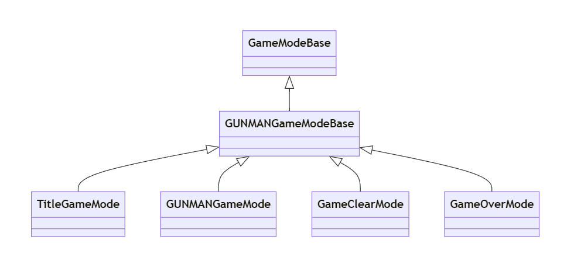

# GUNMANGameMode クラスの概要

## 主な処理内容

  

`AGUNMANGameMode` クラスは、`AGUNMANGameModeBase` を継承した、**バトルマップ専用のゲームモード**です。このクラスでは以下の主要な機能を提供します。

- **Tickの設定**: コンストラクターで毎フレーム `Tick()` を呼び出すように設定。
- **プレイヤーの初期設定**: デフォルトのポーンおよびプレイヤーコントローラーのクラスを指定。
- **制限時間管理**: 制限時間をウィジェットで表示し、経過時間に応じてゲームの勝敗を判断。
- **ゲームの勝敗条件の設定**: 敵を一定数倒すとゲームクリア、制限時間が切れるとゲームオーバー。  
※ プレイヤーキャラクターが死んだときは `GUNMANCharacter` クラスからの処理

このクラスは、バトルの進行状況や時間制限に基づくゲームプレイ管理を行い、特定の条件に応じてマップを変更するなど、バトルゲームにおけるゲームロジックを構築しています。

## このクラスのソースコードの説明

### コンストラクター `AGUNMANGameMode::AGUNMANGameMode()`
- **Tickの設定**: `PrimaryActorTick.bStartWithTickEnabled = true` と `PrimaryActorTick.bCanEverTick = true` によって、毎フレーム `Tick()` 関数が呼び出されるように設定されています。
- **プレイヤーポーンの設定**: `FClassFinder<APawn>` を使って、`ThirdPersonCharacter` ブループリントをデフォルトのポーンとして設定しています。
- **プレイヤーコントローラーの設定**: `PlayerControllerClass` を `AGUNMANController::StaticClass()` に初期化しています。

### `BeginPlay()` 関数
- **制限時間ウィジェットの表示**: `DisplayTimeLimit()` 関数を呼び出して、制限時間を表示するウィジェットを画面に追加します。

### `Tick` 関数
- **制限時間の管理**: 制限時間ウィジェット (`UITimeLimitRef`) を使って、残り時間を更新しています。残り時間が `GameOverTime` 以下になると、ゲームオーバーとして `OpenGameOverMap()` を呼び出します。
- **ゲームクリア条件の判定**: プレイヤーキャラクターの `KillCount` が `GameClearKillCount` に達すると、`OpenGameClearMap()` 関数を一定時間後に呼び出して、ゲームクリア画面に移行します。

### `DisplayTimeLimit` 関数
- **ウィジェットクラスの取得**: 制限時間を表示するために、指定したブループリント `WBP_TimeLimit` のクラスを同期的にロードします。
- **ウィジェットの作成と表示**: プレイヤーコントローラーを取得し、制限時間ウィジェットを作成して画面に表示します。

### `OpenGameClearMap` 関数
- **ゲームクリア時のマップ遷移**: `UGameplayStatics::OpenLevel` を使って、ゲームクリアマップ (`GameClearMap`) を開きます。

### `OpenGameOverMap` 関数
- **ゲームオーバー時のマップ遷移**: `UGameplayStatics::OpenLevel` を使って、ゲームオーバーマップ (`GameOverMap`) を開きます。