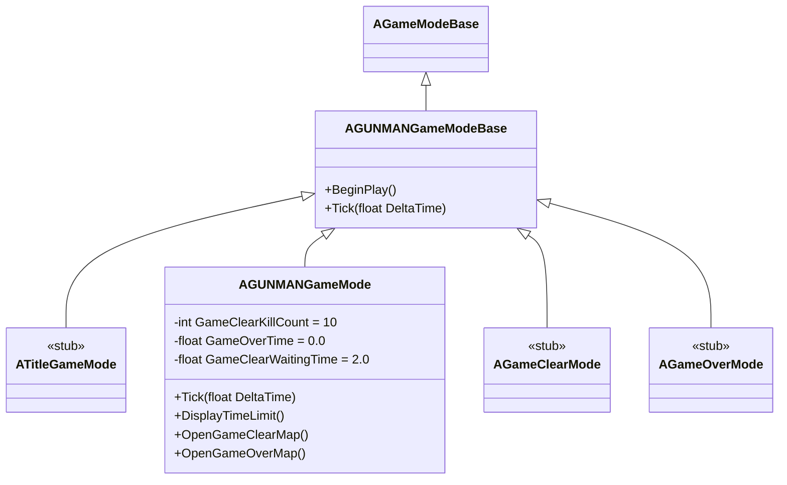

# GUNMANGameModeBase クラスの概要

ソースコード: `Source/GUNMAN/GameModes/GUNMANGameModeBase.h / .cpp`

## 概要

`AGUNMANGameModeBase` は `AGameModeBase` を継承した、全 GameMode の基底クラスです。  
このクラス自体には固有のロジックは持たず、派生クラスが `BeginPlay` / `Tick` をオーバーライドして機能を追加します。

## クラス図

## 関数の説明

### `AGUNMANGameModeBase()` コンストラクタ
特別な初期化処理は行いません。

### `BeginPlay()`
`Super::BeginPlay()` を呼び出します。派生クラスでオーバーライドして初期化処理を追加できます。

### `Tick(float DeltaTime)`
`Super::Tick(DeltaTime)` を呼び出します。派生クラスでオーバーライドしてフレームごとの処理を追加できます。
