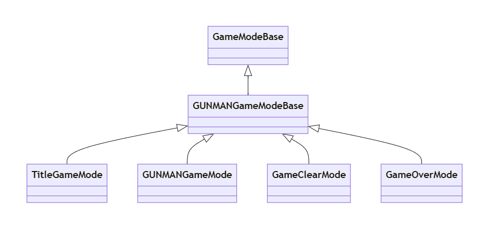

# TitleGameMode クラスの概要

## 主な処理内容

  

`ATitleGameMode` クラスは、基底クラス`AGUNMANGameModeBase` を継承した**タイトルマップ専用のゲームモードクラス**です。このクラスは、タイトル画面のゲームロジックやルールを制御するための基本的なフレームワークを提供します。

現在のところ、クラスは**将来的な拡張**のために定義されていますが、特定の機能や処理は実装されていません。このクラスは、ゲームのタイトル画面で必要となるロジック（UI処理、メニュー操作など）を実装する基盤となります。

## 関数の説明

