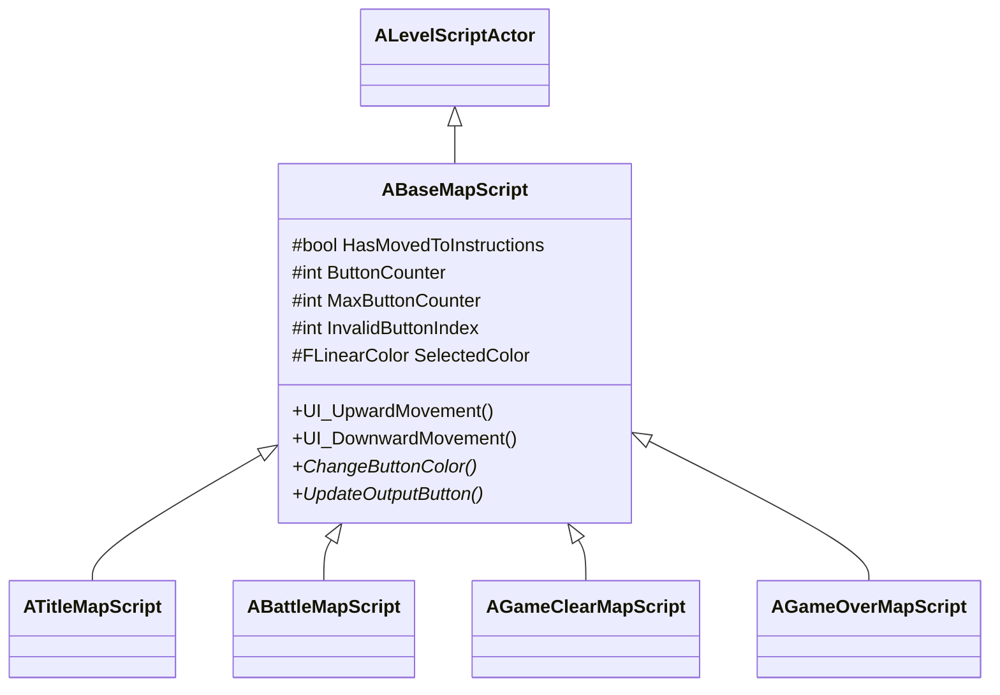

# BaseMapScript クラスの概要

ソースコード: `Source/GUNMAN/LevelScript/BaseMapScript.h / .cpp`

## 概要

`ABaseMapScript` は `ALevelScriptActor` を継承した、全 LevelScript の基底クラスです。  
上下キーによるボタン選択ロジックと、ボタン色変更・決定アクションの仮想関数フックを提供します。  
各マップクラスは `ChangeButtonColor` と `UpdateOutputButton` をオーバーライドして独自の処理を実装します。

## クラス図

## プロパティ一覧

| プロパティ | 型 | 初期値 | 説明 |
|---|---|---|---|
| `HasMovedToInstructions` | `bool` | false | 操作説明パネルに遷移中か。`true` の間は上下移動を無効化 |
| `ButtonCounter` | `int` | 1 | 現在選択中のボタンインデックス（1 始まり） |
| `MaxButtonCounter` | `int` | — | ボタンの最大インデックス（派生クラスが設定） |
| `InvalidButtonIndex` | `int` | — | 範囲外とみなすインデックス（= MaxButtonCounter + 1） |
| `SelectedColor` | `FLinearColor` | — | 選択中ボタンの背景色（エディタで設定） |
| `WidgetClass` | `TSubclassOf<UUserWidget>` | — | 生成する UI ウィジェットのクラス（派生クラスが設定） |

## 関数の説明

### `ABaseMapScript()` コンストラクタ
`HasMovedToInstructions = false`、`ButtonCounter = 1` を初期化します。

### `UI_UpwardMovement()`
`HasMovedToInstructions` が `true` の場合は何もしません。  
それ以外は `ButtonCounter -= 1` し、0 以下になったら `MaxButtonCounter` に折り返します。  
インデックス変更後に `ChangeButtonColor()` を呼びます。

### `UI_DownwardMovement()`
`HasMovedToInstructions` が `true` の場合は何もしません。  
それ以外は `ButtonCounter += 1` し、`InvalidButtonIndex` 以上になったら 1 に折り返します。  
インデックス変更後に `ChangeButtonColor()` を呼びます。

### `ChangeButtonColor()` — 仮想関数
選択状態に応じてボタンの背景色を変更します。基底クラスでは空実装。  
派生クラスでオーバーライドして、全ボタンを白に戻してから選択中のボタンを `SelectedColor` にします。

### `UpdateOutputButton()` — 仮想関数
決定ボタンが押されたときに `ButtonCounter` に応じたアクションを実行します。基底クラスでは空実装。  
派生クラスでオーバーライドして各ボタンのクリックイベントを呼び出します。

### `BeginPlay()`
`Super::BeginPlay()` を呼びます。派生クラスが入力セットアップと UI 生成を追加します。
