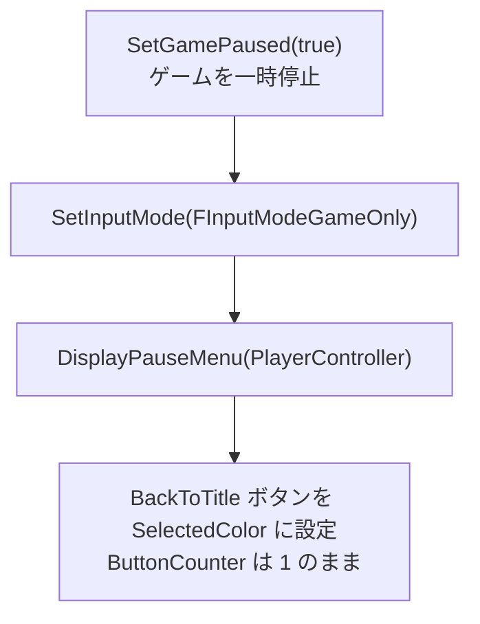

# BattleMapScript クラスの概要

ソースコード: `Source/GUNMAN/LevelScript/BattleMapScript.h / .cpp`

## 概要

`ABattleMapScript` は `ABaseMapScript` を継承した**バトルマップ専用の LevelScript** です。  
ポーズメニューの表示・非表示と、ポーズ中の入力コンテキスト切り替えを管理します。

クラス継承図は [BaseMapScript](BaseMapScript.md) を参照してください。

## プロパティ一覧

| プロパティ | アクセス | 型 | 初期値 | 説明 |
|---|---|---|---|---|
| `PauseMenuMappingContext` | **public** | `UInputMappingContext*` | `IMC_OperatingUI` | ポーズメニュー専用の入力マッピング。`GUNMANCharacter::PressedActionPauseMenu` が直接参照するため public |
| `UI_PaseMenu` | protected | `UUI_PaseMenu*` | null | ポーズメニューウィジェットの参照（※ソース上のスペルミス "Pase"） |
| `UpAction` | private | `UInputAction*` | `IA_UpArrowKey` | 上移動アクション |
| `DownAction` | private | `UInputAction*` | `IA_DownArrowKey` | 下移動アクション |
| `DecisionAction` | private | `UInputAction*` | `IA_Enter` | 決定アクション |
| `MaxButtonCounter` | — | `int` | 3 | ボタン数 |
| `InvalidButtonIndex` | — | `int` | 4 | 範囲外インデックス |

## ボタンインデックスと対応

| ButtonCounter | ボタン | 処理 |
|---|---|---|
| 1 | Back To Title | `OnClickedBackToTitle_Button()` でタイトルへ遷移 |
| 2 | Cancel（ゲームに戻る） | `OnClickedCancel_Button()`・入力コンテキストをゲーム用に戻す・`ButtonCounter = 1` にリセット |
| 3 | Game End | `OnClickedGameEnd_Button()` でアプリ終了 |

## 入力アクション一覧

`BeginPlay` でバインドされます（`IMC_OperatingUI` は `GUNMANCharacter` が `PressedActionPauseMenu` で追加）。

| InputAction | トリガー | コールバック |
|---|---|---|
| `IA_UpArrowKey` | Triggered | `UI_UpwardMovement` |
| `IA_DownArrowKey` | Triggered | `UI_DownwardMovement` |
| `IA_Enter` | Triggered | `UpdateOutputButton` |

## 関数の説明

### `ABattleMapScript()` コンストラクタ
- `MaxButtonCounter = 3`、`InvalidButtonIndex = 4`
- `IMC_OperatingUI` を `PauseMenuMappingContext` としてロード
- `IA_UpArrowKey`・`IA_DownArrowKey`・`IA_Enter` をロード

### `BeginPlay()`
プレイヤーコントローラーの `InputComponent` に上下・決定アクションを直接バインドします。  
ポーズメニューはこの時点では表示せず、`GUNMANCharacter::PressedActionPauseMenu` から `InitializeButtonPosition` が呼ばれたときに表示されます。

### `EndPlay(const EEndPlayReason::Type)`
`PauseMenuMappingContext` を `EnhancedInputLocalPlayerSubsystem` から削除してクリーンアップします。

### `InitializeButtonPosition()`
`GUNMANCharacter::PressedActionPauseMenu` から呼ばれます。

```mermaid
flowchart TD
    A["SetGamePaused(true)\nゲームを一時停止"]
    A --> B["SetInputMode(FInputModeGameOnly)"]
    B --> C["DisplayPauseMenu(PlayerController)"]
    C --> D["BackToTitle ボタンを SelectedColor に設定\nButtonCounter は 1 のまま"]
```

### `DisplayPauseMenu(TObjectPtr<APlayerController>&)`
`WBP_PaseMenu` Blueprint を同期ロードし、`UUI_PaseMenu` ウィジェットを生成して `AddToViewport` します。

### `ChangeButtonColor()`
全ボタン（BackToTitle・Cancel・GameEnd）を白にリセットしてから、  
`ButtonCounter` に対応するボタンを `SelectedColor` に変更します。

### `UpdateOutputButton()`

| ButtonCounter | 処理 |
|---|---|
| 1 | `OnClickedBackToTitle_Button()` → タイトル遷移 |
| 2 | `OnClickedCancel_Button()` でポーズメニューを閉じ、`PauseMenuMappingContext` を削除して `GUNMANCharacter->DefaultMappingContext` を追加。`ButtonCounter = 1` にリセット |
| 3 | `OnClickedGameEnd_Button()` → アプリ終了 |
