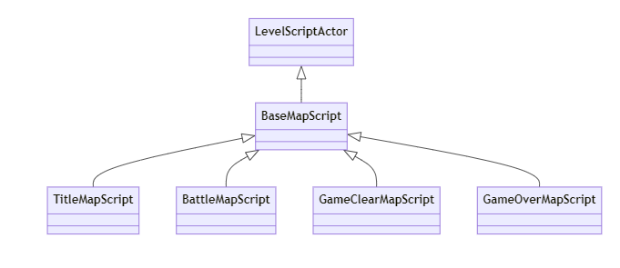

# BattleMapScript クラスの概要

## 主な処理内容

`ABattleMapScript` クラスは、Unreal Engine の `LevelScriptActor` クラスを継承し、`BaseMapScript` クラスも継承しているバトルマップ用のカスタムクラスです。このクラスでは、バトルマップで必要な入力処理やポーズメニューの操作を実装しています。以下は主な機能です。

- **プロパティの初期化**: コンストラクタ内で、ポーズメニュー用ウィジェットの初期化、入力アクション（上下キーや決定キー）のロードが行われています。
- **EnhancedInput の使用**: Enhanced Input System を活用し、バトルマップ用の入力システムを構築しています。プレイヤーが操作するキーイベントを `InputAction` で管理し、ポーズメニューの操作に対応しています。
- **ポーズメニューの管理**: ポーズメニューの表示や非表示、選択状態に応じたボタンの色変更、およびボタンのクリックイベントによる機能実行を行います。
- **仮想関数のオーバライド**: ボタンの色変更やボタン選択に応じた動作をオーバライドして、ポーズメニューの操作を実装しています。

## 関数の説明

### コンストラクタ（`ABattleMapScript::ABattleMapScript`）
- **UI関連のプロパティ初期化**: `UI_PauseMenu`, `UI_Character` を初期化し、`MaxButtonCounter` と `InvalidButtonIndex` を設定します。
- **EnhancedInputアセットのロード**: `ConstructorHelpers::FObjectFinder` を使用して、Enhanced Input の `InputMappingContext` および `InputAction` をロードし、バトルマップでの入力処理を準備します。

###  `BeginPlay` 関数 
- **プレイヤーコントローラーの取得**: `UGameplayStatics::GetPlayerController` を使用して、現在のプレイヤーコントローラーを取得します。
- **マッピングコンテキストの追加**: `EnhancedInputLocalPlayerSubsystem` を通じて、ロードされた `InputMappingContext` をサブシステムに追加します。`EnhancedInputComponent` を取得し、上下キーや決定キーに対応するアクションをバインドしています。

###  `EndPlay` 関数 
- **マッピングコンテキストの削除**: ゲーム終了時に `EnhancedInputLocalPlayerSubsystem` を通じて、ロードされた `InputMappingContext` をサブシステムから削除します。これはポーズメニューが終了した後のクリーンアップ処理です。

###  `ChangeButtonColor` 関数 
- **ボタン色の初期化**: `Back To Title Button`、`Cancel Button`、`End Button` ボタンの色を白にリセットします。
- **選択状態のボタンの色を変更**: `ButtonCounter` の値に応じて、選択されたボタンの色を `SelectedColor` に変更します。

### `UpdateOutputButton` 関数
- **選択されたボタンのアクション実行**: `ButtonCounter` の値に基づき、対応するボタンがクリックされたときの動作を実行します。例えば、`Back To Title Button` が選択されていれば、タイトル画面に戻る機能が実行されます。

### `InitializeButtonPosition` 関数
- ポーズメニューのウィジェットを生成し、画面に表示します。最初に `Back To Title Button` を選択状態に設定し、プレイヤーがゲームパッドで操作できるように入力モードも設定しています。