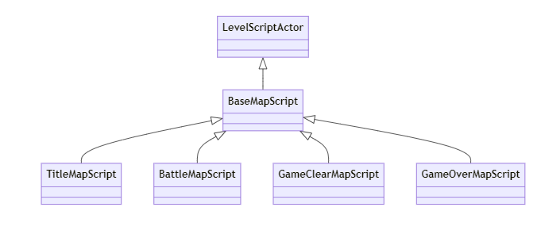

# GameClearMapScript クラスの概要

## 主な処理内容

`GameClearMapScript` クラスは、`LevelScriptActor` と `BaseMapScript` を継承した、ゲームクリアマップ用のカスタムクラスです。このクラスは以下の機能を持っています。

- **ゲームクリアマップ用入力システムの構築**：`EnhancedInput` を利用し、ゲームクリア画面での操作を管理します。`InputAction` や `InputMappingContext` をコンストラクタでロードし、マップ上での入力を処理します。
  
- **ゲームクリアウィジェットの表示**：ゲームクリア時に専用の UI ウィジェットを生成・表示し、ユーザーインターフェースを構築します。

- **ボタンの選択状態に応じた色の変更**：仮想関数 `ChangeButtonColor()` をオーバーライドし、選択されたボタンの色を変更します。

- **クリックイベントのオーバーライド**：選択されたボタンに応じて、適切なアクションが発生する `UpdateOutputButton()` 関数をオーバーライドします。

# 関数の説明

### コンストラクタ （`AGameClearMapScript::AGameClearMapScript`）
このコンストラクタでは、主にプロパティの初期化と `EnhancedInput` 用のアセットをロードしています。
- **UI_GameClear**：ゲームクリア画面のウィジェット。初期値は `NULL`。
- **MaxButtonCounter** と **InvalidButtonIndex**：ボタン選択用のカウンタと無効なボタンインデックスを初期化。
- **InputMappingContext** と **InputAction** のロード：`EnhancedInput` を使うためのマッピングコンテキストと入力アクション（`EnterAction`、`DownArrowKeyAction`、`UpArrowKeyAction`）をロード。

### `BeginPlay()` 関数
ゲームが開始されたときに呼ばれ、以下の処理を行います。
- **プレイヤーコントローラーの取得**：`UGameplayStatics::GetPlayerController()` でプレイヤーのコントローラーを取得。
- **EnhancedInput サブシステムへのコンテキスト追加**：取得したプレイヤーコントローラーに `DefaultMappingContext` を追加し、入力を設定します。
- **ウィジェットの生成と表示**：`WBP_GameClear` というブループリントからウィジェットをロードし、画面に表示します。
- **初期ボタンの選択状態**：初期状態で "Continue" ボタンが選択された状態にし、背景色を `SelectedColor` に変更します。

### `SetupInput()` 関数
この関数では、プレイヤーコントローラーの `InputComponent` を使って、入力に対するアクションをバインドします。
- **BindAction**：`EnterAction`、`DownArrowKeyAction`、`UpArrowKeyAction` の各アクションをそれぞれ `UpdateOutputButton`、`UI_DownwardMovement`、`UI_UpwardMovement` にバインドし、プレイヤーが対応するキーを押したときの処理を行います。

### `ChangeButtonColor()` 関数
この関数はボタンの選択状態に応じて色を変更します。
- **ContinueButton と EndButton の背景色変更**：選択されたボタンに応じて背景色を `SelectedColor` に変更し、他のボタンの色は白色に戻します。

### `UpdateOutputButton()` 関数
選択されているボタンに応じて、対応するアクションを実行します。
- **ボタンの切り替え**：`ButtonCounter` の値に基づいて、`UI_GameClear->OnClickedContinue_Button()` または `UI_GameClear->OnClickedGameEnd_Button()` を呼び出し、対応するボタンがクリックされたときのイベントを発生させます。