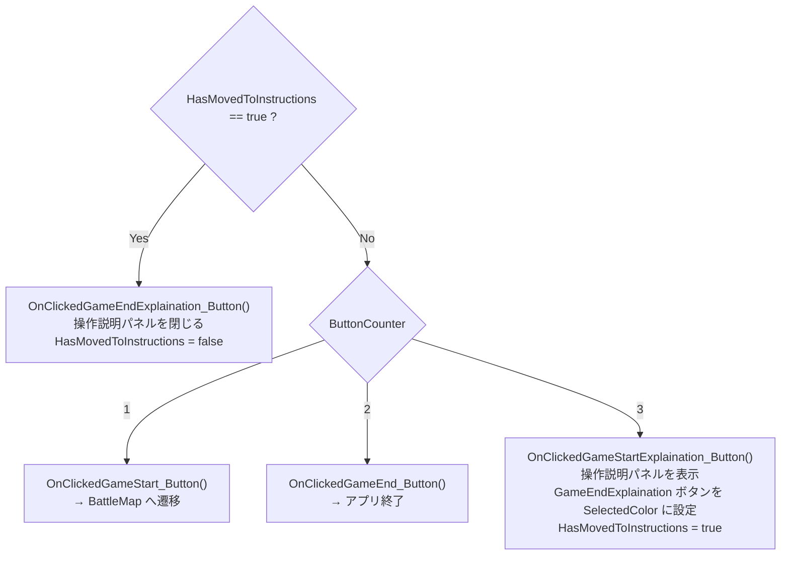

# TitleMapScript クラスの概要

ソースコード: `Source/GUNMAN/LevelScript/TitleMapScript.h / .cpp`

## 概要

`ATitleMapScript` は `ABaseMapScript` を継承した**タイトルマップ専用の LevelScript** です。  
タイトルメニューの表示・ボタン選択・操作説明パネルの開閉を管理します。

クラス継承図は [BaseMapScript](BaseMapScript.md) を参照してください。

## プロパティ一覧

| プロパティ | 型 | 初期値 | 説明 |
|---|---|---|---|
| `UI_Title` | `UUITitle*` | null | タイトルメニューウィジェットの参照 |
| `DefaultMappingContext` | `UInputMappingContext*` | `IMC_OperatingUI` | UI 操作用の入力マッピング |
| `EnterAction` | `UInputAction*` | `IA_Enter` | 決定アクション |
| `DownArrowKeyAction` | `UInputAction*` | `IA_DownArrowKey` | 下移動アクション |
| `UpArrowKeyAction` | `UInputAction*` | `IA_UpArrowKey` | 上移動アクション |
| `MaxButtonCounter` | `int` | 3 | ボタン数 |
| `InvalidButtonIndex` | `int` | 4 | 範囲外インデックス |

## ボタンインデックスと対応

| ButtonCounter | ボタン | 処理 |
|---|---|---|
| 1 | Game Start | `OnClickedGameStart_Button()` → BattleMap へ遷移 |
| 2 | Game End | `OnClickedGameEnd_Button()` → アプリ終了 |
| 3 | ?（操作説明） | `OnClickedGameStartExplaination_Button()` → 操作説明パネルを表示、`HasMovedToInstructions = true` |

## 入力アクション一覧

| InputAction | トリガー | コールバック |
|---|---|---|
| `IA_Enter` | Triggered | `UpdateOutputButton` |
| `IA_DownArrowKey` | Triggered | `UI_DownwardMovement` |
| `IA_UpArrowKey` | Triggered | `UI_UpwardMovement` |

## 関数の説明

### `ATitleMapScript()` コンストラクタ
- `MaxButtonCounter = 3`、`InvalidButtonIndex = 4`
- `IMC_OperatingUI` / `IA_Enter` / `IA_DownArrowKey` / `IA_UpArrowKey` をロード

### `BeginPlay()`
1. `IMC_OperatingUI` を `EnhancedInputLocalPlayerSubsystem` に追加
2. `SetupInput` で入力アクションをバインド
3. `WBP_Title` を同期ロードして `UUITitle` ウィジェットを生成・`AddToViewport`
4. `SetInputMode(FInputModeGameOnly)` でゲームパッド操作を有効化
5. `GameStart` ボタンを `SelectedColor` で初期選択状態にする

### `SetupInput(TObjectPtr<UInputComponent>)`
`EnhancedInputComponent` に Enter・Down・Up アクションを上表のコールバックにバインドします。

### `ChangeButtonColor()`
全ボタン（GameStart・GameEnd・?）を白にリセットしてから、`ButtonCounter` に対応するボタンを `SelectedColor` にします。

### `UpdateOutputButton()`

操作説明パネル表示中（`HasMovedToInstructions == true`）に Enter を押すと、  
パネルを閉じて `HasMovedToInstructions = false` に戻ります。  
`UI_UpwardMovement` / `UI_DownwardMovement` は `HasMovedToInstructions` が `true` の間は無効化されます。
