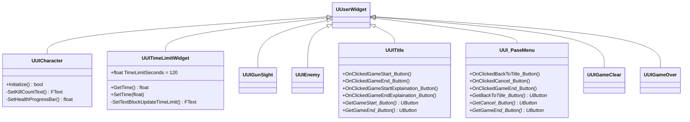

# GUNMAN - UI (UMG)

UMG (Unreal Motion Graphics) で実装された UI ウィジェットクラスです。

## クラス図

## バトル中 HUD

| ファイル | Blueprint | 概要 |
|---|---|---|
| [UI_Character](UI_Character.md) | `WBP_UICharacter` | 体力バーとキル数をリアルタイム表示。キル数が 4・9・14… のときアニメーション再生 |
| [UI_TimeLimit](UI_TimeLimit.md) | `WBP_TimeLimit` | 残り時間（初期値 120 秒）を TextBlock に Delegate バインドで表示 |
| [UIGunSight](UIGunSight.md) | `WBP_UIGunSight` | エイム時に表示される照準（クロスヘア）。コード上は空クラス |
| [UI_Enemy](UI_Enemy.md) | — | 敵頭上に表示される体力バー。`SetOwningEnemy` で参照先を設定 |

## メニュー・画面遷移

| ファイル | Blueprint | 対応シーン | 概要 |
|---|---|---|---|
| [UI_Title](UI_Title.md) | `WBP_Title` | タイトル | 開始・終了・操作説明ボタンと説明パネルの開閉 |
| [UI_PauseMenu](UI_PauseMenu.md) | `WBP_PaseMenu` | バトル | タイトルへ戻る・ゲームに戻る・終了の 3 ボタン。ポーズ解除処理付き |
| [UI_GameClear](UI_GameClear.md) | `WBP_GameClear` | クリア | Continue（タイトルへ）・終了の 2 ボタン |
| [UI_GameOver](UI_GameOver.md) | `WBP_GameOver` | オーバー | Continue（タイトルへ）・終了の 2 ボタン |

## 設計ポイント

- 体力・キル数・タイマーの値は `PercentDelegate` / `TextDelegate` を介してバインドされており、毎フレーム明示的に更新を呼ばずにリアルタイム反映されます
- LevelScript（`ATitleMapScript` / `ABattleMapScript` など）がボタンの背景色を直接操作するため、各ウィジェットは `GetXxx_Button()` Getter を公開しています
