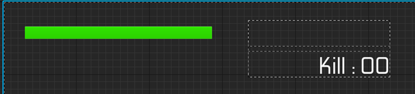

# UICharacter クラスの概要

## 主な処理内容

`UICharacter` クラスは、プレイヤーキャラクターの体力倒した敵の数を画面上に表示するためのUIウィジェットクラスです。このクラスの主な役割は、プレイヤーの体力を示す `ProgressBar` と、敵を倒した数を表示する `TextBlock` にリアルタイムで値をバインドすることです。プレイヤーが敵を一定数倒すと、特定のUIアニメーションを再生する機能も備えています。

## 関数の説明

### Initialize 関数

`Initialize` 関数は、ウィジェットが初期化される際に呼び出されます。`Super::Initialize()` の結果が `false` だった場合、処理を中断して `false` を返す仕組みになっています。ウィジェットが正常に初期化されると、`KillCount_TextBlock` の `TextDelegate` と `Health_ProgressBar` の `PercentDelegate` にそれぞれ、`SetKillCountText` と `SetHealthProgressBar` という関数をバインドします。これにより、UI要素が更新されるたびにこれらの関数が呼び出され、リアルタイムでUIに反映されます。

### SetKillCountText 関数

この関数は、プレイヤーが倒した敵の数を `KillCount_TextBlock` に表示するために使用されます。`UGameplayStatics::GetPlayerCharacter` を使用してプレイヤーキャラクターの参照を取得し、それを `AGUNMANCharacter` にキャストします。

- プレイヤーが敵を倒した数 (`KillCount`) を取得し、5体ごとに特定のアニメーション (`MoveKillCount`) を再生します。
- アニメーションが再生された後、または再生条件が満たされていない場合に、敵を倒した数をテキストに変換して返します。
- プレイヤーキャラクターが取得できなかった場合、空のテキスト (`FText()`) を返します。

### SetHealthProgressBar 関数

この関数は、プレイヤーの体力を示す `ProgressBar` に表示する割合を計算するために使用されます。`SetKillCountText` と同様に、`UGameplayStatics::GetPlayerCharacter` を使用してプレイヤーキャラクターの参照を取得し、`AGUNMANCharacter` にキャストします。

- プレイヤーの現在の体力の割合 (`GetHealthPercent()`) を取得し、それを `ProgressBar` に表示するために返します。
- プレイヤーキャラクターが取得できなかった場合、`0.0f` を返します。