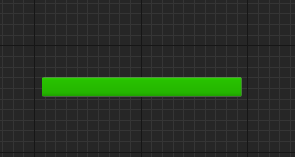

# UIEnemy クラスの概要

## 主な処理内容

`UIEnemy` クラスは、敵キャラクターの体力を表示するためのUIウィジェットクラスです。このクラスの主な役割は、敵キャラクターの体力を示す `ProgressBar` にリアルタイムで体力の割合をバインドすることです。また、このクラスは `OwningEnemy` という変数を持ち、その敵キャラクターの体力を参照してUIを更新します。

## 関数の説明

### Initialize 関数

`Initialize` 関数は、ウィジェットが初期化される際に呼び出されます。`Super::Initialize()` の結果が `false` であった場合、処理を中断して `false` を返します。ウィジェットが正常に初期化された場合は、`Health_ProgressBar` の `PercentDelegate` に `SetHealthProgressBar` 関数をバインドします。これにより、`ProgressBar` が更新されるたびに `SetHealthProgressBar` 関数が呼び出され、敵の体力の割合が表示されるようになります。

### SetHealthProgressBar 関数

この関数は、`ProgressBar` に表示する敵の体力の割合を計算するために使用されます。

- `OwningEnemy` が設定されている場合、`GetHealthPercent` 関数を呼び出して、その体力の割合を返します。
- `OwningEnemy` が設定されていない場合、`0.0f` を返し、`ProgressBar` は空の状態となります。

### SetOwningEnemy 関数

この関数は、`OwningEnemy` 変数に新しい敵キャラクターを設定します。

- `NewOwner` には `AAIEnemy` クラスのオブジェクトが渡され、これを `OwningEnemy` として保存します。
- この設定により、`SetHealthProgressBar` 関数で適切な敵キャラクターの体力を表示することが可能になります。