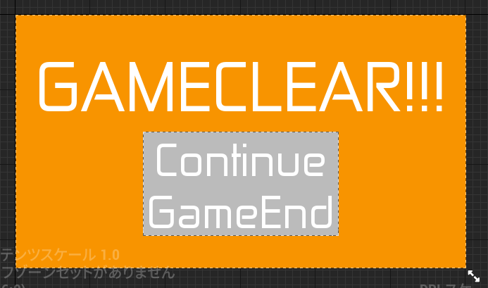

# UIGameClear クラスクラスの概要

## 主な処理内容

  

`UIGameClear` クラスは、ゲームクリア画面を表示するためのUIウィジェットクラスです。このクラスには、次の2つのボタンが含まれています。

1. **ゲームを続けるボタン**: タイトル画面に戻る。
2. **ゲームを終了するボタン**: ゲームを終了する。

このクラスでは、ボタンクリック時の処理を関数として実装しています。そして、これらの処理は `LevelScriptActor` を継承した `BaseMapScript` クラスを基底クラスとし、そのクラスを継承したゲームクリアマップ用の `GameClearMapScript` クラスで呼び出すことが可能です。

## 関数の説明

### OnClickedContinue_Button 関数

この関数は、ゲームを続けるボタンがクリックされた際に呼び出されます。

- `UGameplayStatics::OpenLevel` 関数を使用して、"TitleMap" という名前のレベル（タイトル画面）をロードし、ゲームを再開します。この処理により、プレイヤーはゲームのタイトル画面に戻ることができます。

### OnClickedGameEnd_Button 関数

この関数は、ゲーム終了ボタンがクリックされた際に呼び出されます。

- `UKismetSystemLibrary::QuitGame` 関数を使用してゲームを終了します。`EQuitPreference::Quit` を指定することで、プレイヤーがゲームを完全に終了できるようにしています。