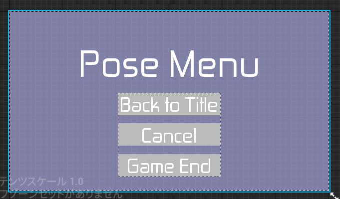
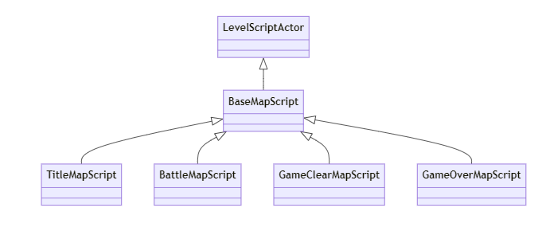

# UI_PaseMenu クラスの概要

## 主な処理内容

  

`UI_PaseMenu` クラスは、ゲームのポーズメニューを表示するためのUIウィジェットクラスです。このクラスには、以下の3つのボタンが含まれています。

1. **タイトルに戻るボタン**: ゲームを一時停止し、タイトル画面に戻ります。
2. **ゲームに戻るボタン**: ポーズを解除してゲームプレイに戻ります。
3. **ゲームを終了するボタン**: ゲームを終了します。

このクラスでは、各ボタンのクリック時の処理を関数として実装しており、`LevelScriptActor` を継承した `BaseMapScript` クラスを基底クラスとし、そのクラスを継承したバトルマップ用の ``BattleMapScript`` クラスでこれらの処理を呼び出すことができます。

## 関数の説明

### OnClickedBackToTitle_Button 関数

この関数は、「タイトルに戻る」ボタンがクリックされた際に呼び出されます。

- `UGameplayStatics::OpenLevel` 関数を使用して、"TitleMap" という名前のレベル（タイトル画面）をロードします。この処理により、プレイヤーはポーズメニューからタイトル画面に戻ることができます。

### OnClickedCancel_Button 関数

この関数は、「ゲームに戻る」ボタンがクリックされた際に呼び出されます。

- `RemoveFromParent` 関数を使用してポーズメニューを閉じ、ウィジェットを画面から削除します。
- `UGameplayStatics::SetGamePaused` 関数を使って、ゲームのポーズ状態を解除します。`false` を引数として渡すことで、ゲームが再開されます。

### OnClickedGameEnd_Button 関数

この関数は、「ゲーム終了」ボタンがクリックされた際に呼び出されます。

- `UKismetSystemLibrary::QuitGame` 関数を使用してゲームを終了します。`EQuitPreference::Quit` を指定することで、プレイヤーがゲームを完全に終了できるようにしています。