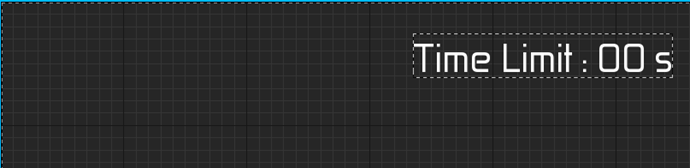

# UITimeLimitWidget クラスの概要

## 主な処理内容

`UITimeLimitWidget` クラスは、ゲームの制限時間を表示するためのUIウィジェットクラスです。このクラスの主な役割は、ゲームの残り時間をリアルタイムで更新し、その時間を表示する `TextBlock` にバインドすることです。

## 関数の説明

### Initialize 関数

`Initialize` 関数は、ウィジェットが初期化される際に呼び出されます。`Super::Initialize()` 関数の結果を確認し、`false` が返された場合は処理を中断して `false` を返します。ウィジェットが正常に初期化されると、`TimeRemoving_TextBlock` の `TextDelegate` に `SetTextBlockUpdateTimeLimit` 関数をバインドします。これにより、時間が更新されるたびに `TextBlock` に表示されるテキストが更新されます。

### SetTextBlockUpdateTimeLimit 関数

この関数は、制限時間を `TextBlock` に表示するために使用されます。

- `UKismetMathLibrary::Round` を使って `TimeLimitSeconds` を四捨五入し、その整数値を `UKismetTextLibrary::Conv_IntToText` 関数でテキストに変換して返します。
- これにより、ゲームの残り時間が `TextBlock` にリアルタイムで表示されます。