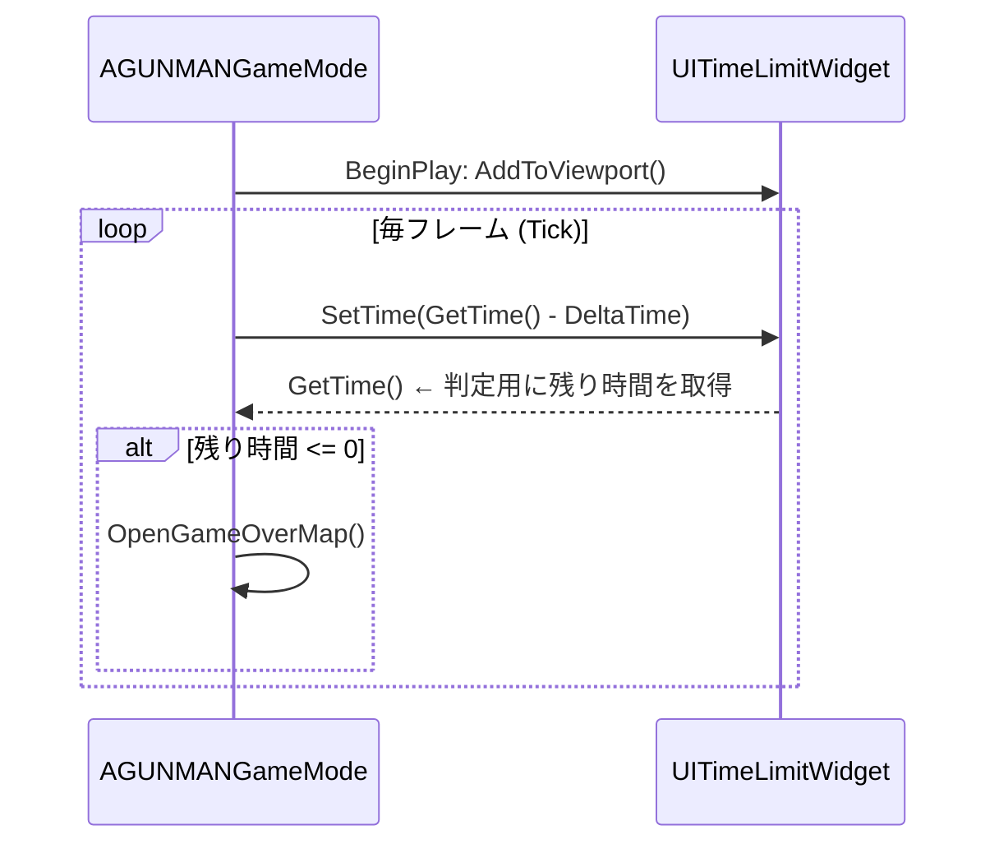

# UITimeLimitWidget クラスの概要

ソースコード: `Source/GUNMAN/UMG/UITimeLimitWidget.h / .cpp`  
Blueprint: `WBP_TimeLimit`

## 概要

`UUITimeLimitWidget` はゲームの残り時間を表示するタイマーウィジェットです。  
`AGUNMANGameMode::BeginPlay` で生成・表示され、`Tick` から `SetTime` で毎フレーム時間が減算されます。

## ウィジェットコンポーネント

| コンポーネント | 型 | 役割 |
|---|---|---|
| `TimeLimit_TextBlock` | `UTextBlock` | "TIME" などのラベルテキスト（静的表示） |
| `TimeRemoving_TextBlock` | `UTextBlock` | カウントダウン値を表示（`TextDelegate` バインド） |

## プロパティ

| プロパティ | 型 | 初期値 | 説明 |
|---|---|---|---|
| `TimeLimitSeconds` | `float` | **120.0** | 残り時間（秒）。2 分がデフォルト |

## 関数の説明

### `Initialize()`

`TimeRemoving_TextBlock->TextDelegate` に `SetTextBlockUpdateTimeLimit` をバインドします。  
これにより `GUNMANGameMode::Tick` で `SetTime` を呼ぶだけで表示が自動更新されます。

### `SetTextBlockUpdateTimeLimit()`

`UKismetMathLibrary::Round(TimeLimitSeconds)` で四捨五入した整数値をテキストに変換して返します。  
`TimeRemoving_TextBlock` の `TextDelegate` から毎フレーム呼ばれます。

### `GetTime() const`

`TimeLimitSeconds` を返します。`AGUNMANGameMode::Tick` が残り時間の判定に使用します。

### `SetTime(float time)`

`TimeLimitSeconds = time` を設定します。  
`AGUNMANGameMode::Tick` から `SetTime(GetTime() - DeltaTime)` として毎フレーム呼ばれ、時間を減算します。

## GUNMANGameMode との連携

```mermaid
sequenceDiagram
    participant GM as AGUNMANGameMode
    participant W as UITimeLimitWidget

    GM->>W: BeginPlay: AddToViewport()
    loop 毎フレーム (Tick)
        GM->>W: SetTime(GetTime() - DeltaTime)
        W-->>GM: GetTime() ← 判定用に残り時間を取得
        alt 残り時間 <= 0
            GM->>GM: OpenGameOverMap()
        end
    end
```
