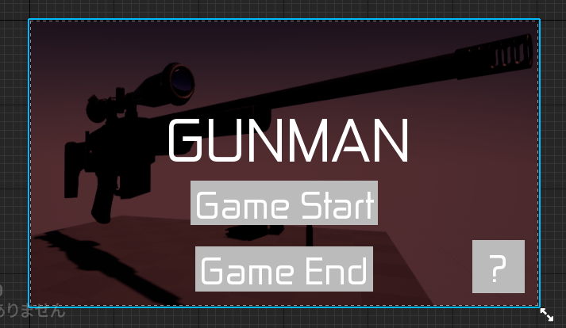
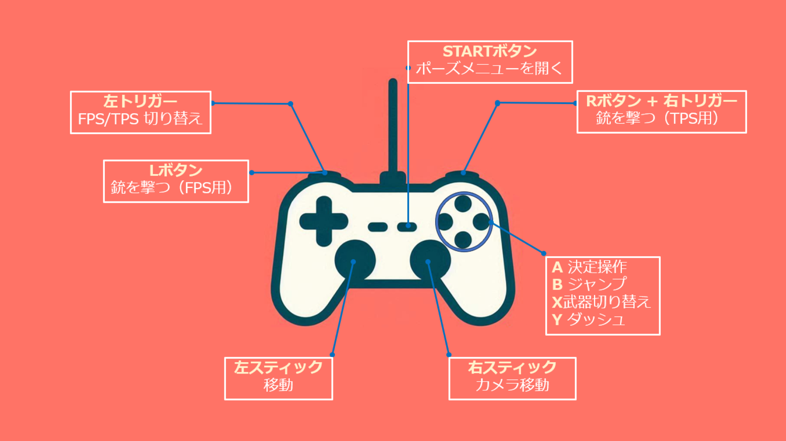

# UITitle クラスの概要

## 主な処理内容

  

`UITitle` クラスは、ゲームのタイトルメニュー画面のUIウィジェットを担当するクラスです。このクラスは、次の3つのボタンを提供します。

1. **ゲーム開始ボタン**: ゲームを開始する。
2. **ゲーム終了ボタン**: ゲームを終了する。
3. **?ボタン**: ゲームの操作方法を説明する画像を表示する。

このクラスでは、ボタンクリック時の処理が関数として実装されており、それぞれのボタンに対応した機能が実行されます。さらに、このクラスで行われる処理は、`LevelScriptActor` を継承した `BaseMapScript` クラスを基底クラスとして、そのクラスを継承した `TitleMapScript` クラスで呼び出すことができます。

## 関数の説明

### OnClickedGameStart_Button 関数

この関数は、ゲーム開始ボタンがクリックされた際に呼び出されます。

- `UGameplayStatics::OpenLevel` 関数を使用して、"BattleMap" という名前のレベルをロードし、ゲームを開始します。

### OnClickedGameEnd_Button 関数

この関数は、ゲーム終了ボタンがクリックされた際に呼び出されます。

- `UKismetSystemLibrary::QuitGame` 関数を使用してゲームを終了します。`EQuitPreference::Quit` を指定することで、プレイヤーがゲームを完全に終了できるようにしています。

### OnClickedGameStartExplaination_Button 関数

この関数は、?ボタン（ゲーム操作方法を説明するボタン）がクリックされた際に呼び出されます。

- `Explaination_CanvasPanel` の表示状態を `ESlateVisibility::SelfHitTestInvisible` に設定し、操作説明の画像を表示します。

### OnClickedGameEndExplaination_Button 関数

この関数は、操作説明を閉じるボタンがクリックされた際に呼び出されます。

- `Explaination_CanvasPanel` の表示状態を `ESlateVisibility::Hidden` に設定し、操作説明の画像を非表示にします。