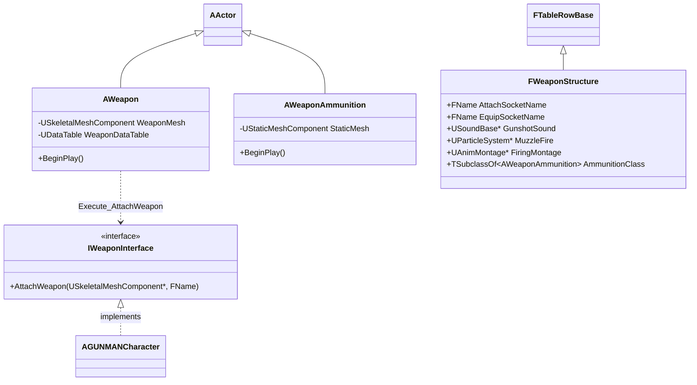
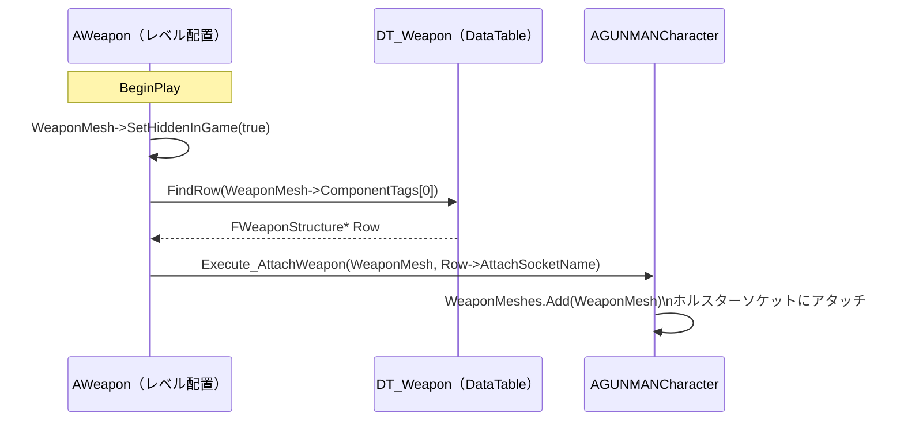

# GUNMAN - 武器

ソースコードの対応場所: `Source/GUNMAN/ArmedWeapon/`

武器のデータ管理・アタッチ処理・薬莢演出に関するクラスです。

## クラス図

## 武器登録フロー

## ファイル一覧

| ファイル | 概要 |
|---|---|
| [WeaponStructure](WeaponStructure.md) | DataTable 行構造体。ソケット名・SE・エフェクト・モンタージュ・薬莢クラスを一元管理 |
| [Weapon](Weapon.md) | レベル配置の武器アクター。`BeginPlay` で DataTable を参照し `GUNMANCharacter` へ自動登録 |
| [WeaponInterface](WeaponInterface.md) | 武器登録の共通インターフェース（`Blueprintable`）。`AGUNMANCharacter` が実装 |
| [WeaponAmmunition](WeaponAmmunition.md) | TPS 発射・敵攻撃時にスポーンされる薬莢アクター。プレイヤーの右方向に物理演出 |

## 設計ポイント

- 武器固有のパラメータはすべて `DT_Weapon` に集約。C++ 側に武器種別の分岐がなく、DataTable の行を追加するだけで新武器を追加できます
- `WeaponMesh->ComponentTags[0]` を行名キーとして使うことで、同じ `AWeapon` クラスから Blueprint タグの違いだけで異なる武器設定を読み込めます
- ソケットは用途で使い分けます：`AttachSocketName`（ホルスター）は所持中、`EquipSocketName`（右手）は装備中に使用します
