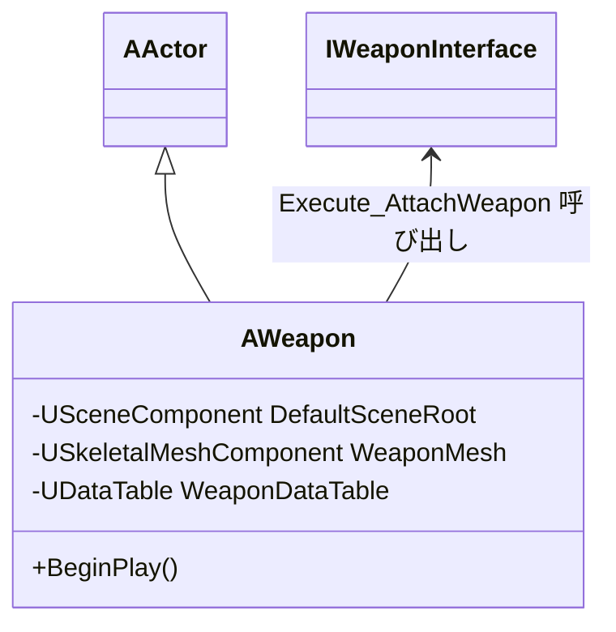
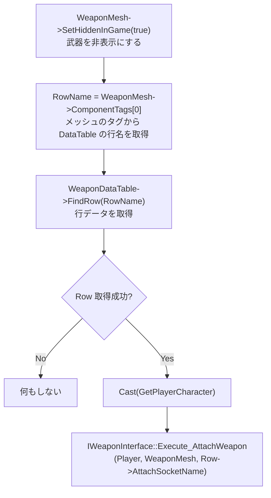

# Weapon クラスの概要

ソースコード: `Source/GUNMAN/ArmedWeapon/Weapon.h / .cpp`

## 概要

`AWeapon` はレベルに配置する武器アクタークラスです。  
`BeginPlay` 時に自身を `GUNMANCharacter` へ自動登録し、ホルスター位置にアタッチします。  
実際にプレイヤーが装備・使用する処理は `GUNMANCharacter::AttachingAndRemovingGun` が担います。

## クラス図

## コンポーネント一覧

| コンポーネント | 型 | 説明 |
|---|---|---|
| `DefaultSceneRoot` | `USceneComponent` | ルートコンポーネント |
| `WeaponMesh` | `USkeletalMeshComponent` | 武器メッシュ。`DefaultSceneRoot` の子。`ComponentTags[0]` に DataTable 行名を設定する |
| `WeaponDataTable` | `UDataTable` | `DT_Weapon` への参照（コンストラクタでロード） |

## 関数の説明

### `AWeapon()` コンストラクタ

`DefaultSceneRoot` → `WeaponMesh` の順でコンポーネントを生成し、`DT_Weapon` をロードします。

### `BeginPlay()`

**`ComponentTags[0]` による DataTable 参照の仕組み**  
`WeaponMesh` の `ComponentTags` 配列の先頭要素が DataTable の行名として使われます。  
Blueprint 側でタグを `"Rifle"` / `"Shotgun"` / `"Pistol"` などに設定することで、  
同じ `AWeapon` クラスから異なる武器設定を読み込めます。

**`AttachSocketName`（ホルスター）が使われる理由**  
`BeginPlay` 時点では武器はまだ「所持しているだけ」の状態です。  
`AttachSocketName` はホルスター位置（`ThirdPersonidle` ポーズ用ソケット）を指し、  
プレイヤーが装備操作をした際に `EquipSocketName`（右手ソケット）へ付け替えられます。

| タイミング | 使用ソケット | 呼び出し元 |
|---|---|---|
| `AWeapon::BeginPlay` | `AttachSocketName`（ホルスター） | 自動（レベル開始時） |
| `GUNMANCharacter::AttachingAndRemovingGun` 装備時 | `EquipSocketName`（右手） | プレイヤー入力 |
| `GUNMANCharacter::AttachingAndRemovingGun` 解除時 | `AttachSocketName`（ホルスター） | プレイヤー入力 |
