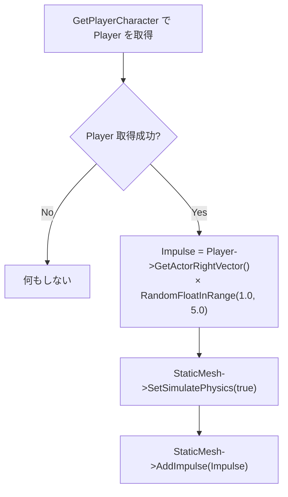

# WeaponAmmunition クラスの概要

ソースコード: `Source/GUNMAN/ArmedWeapon/WeaponAmmunition.h / .cpp`

## 概要

`AWeaponAmmunition` は発射時にスポーンされる**薬莢（排莢）アクター**です。  
`BeginPlay` で物理シミュレーションを有効にし、プレイヤーの右方向にランダムな力を加えて飛ばします。

## スポーン元

| スポーン元 | 条件 |
|---|---|
| `GUNMANCharacter::AnimationAtFiring` | TPS モードで発射したとき（`EquippedWeaponInfo.AmmunitionClass` のクラスを使用） |
| `AAIEnemy::AttackCharacter_Implementation` | 敵が攻撃したとき（`EquippedWeaponInformation.AmmunitionClass` のクラスを使用） |

## コンポーネント一覧

| コンポーネント | 型 | 説明 |
|---|---|---|
| `DefaultSceneRoot` | `USceneComponent` | ルートコンポーネント |
| `StaticMesh` | `UStaticMeshComponent` | 薬莢の外観メッシュ。`DefaultSceneRoot` の子 |

## 関数の説明

### `AWeaponAmmunition()` コンストラクタ

`DefaultSceneRoot` → `StaticMesh` の順でコンポーネントを生成します。  
物理シミュレーションはまだ有効にしません（`BeginPlay` で有効化）。

### `BeginPlay()`

- **インパルス方向**: プレイヤーの**右方向ベクトル**（`GetActorRightVector`）
- **インパルス大きさ**: 1.0〜5.0 のランダム値を右方向ベクトルにスカラー倍

> プレイヤーの向きによって薬莢の飛ぶ方向が変わるため、自然な排莢演出になっています。  
> FPS モード（`AnimationAtFiring` の FPS 分岐）では `WeaponAmmunition` はスポーンされません。
