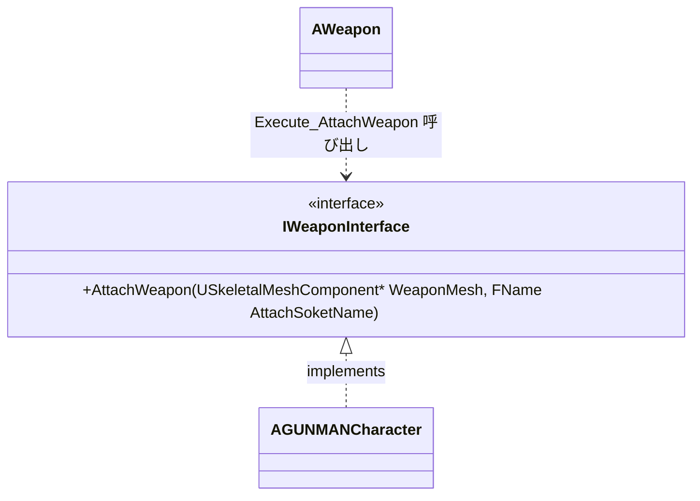

# WeaponInterface クラスの概要

ソースコード: `Source/GUNMAN/ArmedWeapon/WeaponInterface.h / .cpp`

## 概要

`IWeaponInterface` は武器をキャラクターへ登録する処理を抽象化するインターフェースです。  
`UINTERFACE` マクロに `Blueprintable` が指定されており、Blueprint でも実装できます。  
`AWeapon::BeginPlay` が呼び出し側、`AGUNMANCharacter` が実装側です。

## クラス図

## 関数の説明

### `AttachWeapon(USkeletalMeshComponent* WeaponMesh, FName AttachSoketName)`

`BlueprintNativeEvent` として宣言されており、C++ と Blueprint の両方で実装できます。

| 引数 | 説明 |
|---|---|
| `WeaponMesh` | アタッチする武器のスケルタルメッシュ |
| `AttachSoketName` | アタッチ先のソケット名（※引数名も "Soket" のスペルミス） |

**実装クラス**: `AGUNMANCharacter::AttachWeapon_Implementation`  
→ `WeaponMeshes` 配列に `WeaponMesh` を追加し、指定ソケットにアタッチします。

**呼び出し元**: `AWeapon::BeginPlay`  
→ `Interface->Execute_AttachWeapon(Player, WeaponMesh, Row->AttachSocketName)` で呼ばれます。
