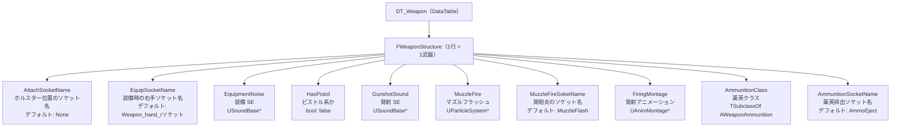

# WeaponStructure 構造体の概要

ソースコード: `Source/GUNMAN/ArmedWeapon/WeaponStructure.h`

## 概要

`FWeaponStructure` は `FTableRowBase` を継承した DataTable 行構造体です。  
`DT_Weapon` の 1 行が 1 武器に対応し、武器に必要なソケット名・SE・エフェクト・アニメーション・弾薬を一元管理します。

## DataTable 構造

## プロパティ一覧

| フィールド | 型 | デフォルト値 | 説明 |
|---|---|---|---|
| `AttachSocketName` | `FName` | `"None"` | ホルスター位置のソケット名。`AWeapon::BeginPlay` と武器解除時に使用 |
| `EquipSocketName` | `FName` | `"Weapon_hand_rソケット"` | 右手の装備ソケット名。装備時に使用（※デフォルト値に日本語を含む） |
| `EquipmentNoise` | `USoundBase*` | null | 武器を装備するときの SE |
| `HasPistol` | `bool` | false | ピストル系の武器か（アニメーションの姿勢分岐に使用） |
| `GunshotSound` | `USoundBase*` | null | 発射時の SE |
| `MuzzleFire` | `UParticleSystem*` | null | マズルフラッシュのパーティクル |
| `MuzzleFireSoketName` | `FName` | `"MuzzleFlash"` | マズルフラッシュを出すソケット名（※フィールド名は "Soket" のスペルミス） |
| `FiringMontage` | `UAnimMontage*` | null | 発射時にキャラクターで再生するアニメーションモンタージュ |
| `AmmunitionClass` | `TSubclassOf<AWeaponAmmunition>` | null | スポーンする薬莢アクタークラス |
| `AmmunitionSocketName` | `FName` | `"AmmoEject"` | 薬莢が排出されるソケット名 |

> **スペルミスについて**  
> `MuzzleFireSoketName` は "Socket" の "c" が欠落しています（ソース上の実装に合わせて記載）。

## DataTable の行名と武器の対応

DataTable の行名は `AWeapon::WeaponMesh->ComponentTags[0]`（Blueprint 側で設定）と  
`AAIEnemy::BeginPlay` のハードコード値で参照されます。

| 行名 | 参照元 | 用途 |
|---|---|---|
| `"Rifle"` | `AAIEnemy::BeginPlay`（ハードコード） | 全敵キャラクターが使用する固定武器 |
| `"Rifle"` / `"Shotgun"` / `"Pistol"` など | `AWeapon::WeaponMesh->ComponentTags[0]` | プレイヤーが持つ各武器 Blueprint のタグ設定 |

## 各フィールドの使用箇所

| フィールド | 使用クラス |
|---|---|
| `AttachSocketName` | `AWeapon::BeginPlay`、`GUNMANCharacter::AttachingAndRemovingGun`（解除時） |
| `EquipSocketName` | `GUNMANCharacter::AttachingAndRemovingGun`（装備時）、`AAIEnemy::BeginPlay` |
| `EquipmentNoise` | `GUNMANCharacter::AttachingAndRemovingGun` |
| `HasPistol` | `GUNMANCharacter::EquipWeapon`（アニメーション分岐） |
| `GunshotSound` | `GUNMANCharacter::AnimationAtFiring`、`AAIEnemy::AttackCharacter_Implementation` |
| `MuzzleFire` | `GUNMANCharacter::AnimationAtFiring`、`AAIEnemy::AttackCharacter_Implementation` |
| `MuzzleFireSoketName` | `GUNMANCharacter::AnimationAtFiring`、`AAIEnemy::AttackCharacter_Implementation`、`AAIEnemy::CreateAmmunition` |
| `FiringMontage` | `GUNMANCharacter::AnimationAtFiring`、`AAIEnemy::AttackCharacter_Implementation` |
| `AmmunitionClass` | `GUNMANCharacter::AnimationAtFiring`、`AAIEnemy::AttackCharacter_Implementation` |
| `AmmunitionSocketName` | `AAIEnemy::CreateAmmunition`（ライントレース開始点） |
