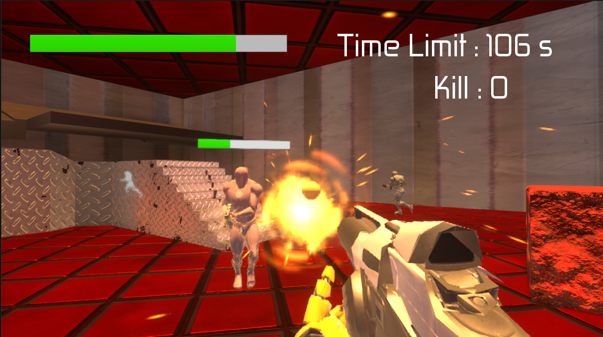

## ■ ゲームの概要



【ゲームタイトル】GUNMAN  
【ジャンル】FPS/TPSゲーム   
【難易度】普通  
【プレイ時間】2分  
【対象年齢】全年齢対象  
【開発環境】Unreal Engine 5.3.2  

> [!CAUTION]
> **このリポジトリは基本的にソースコードのみを公開しています。ゲームを起動するためのアセットファイルはほとんど含まれていません。動作確認はできませんが、ソースコードの確認としてご利用ください。**

### ソースコード：詳細情報
[Documentation](Documentation/) をチェックしてください。

## ■ ゲームの内容

### 【ゲームコンセプト】  

#### 制限時間内に迫り来る敵を撃退し、生き残れ！

プレイヤーはフィールド上で襲い来る敵を時間内に規定数倒さなければならない。敵はプレイヤーを発見すると追跡・攻撃してくるため、立ち回りと武器選択が勝敗を分ける。銃の特性を活かした戦術的な戦いが楽しめる、**サバイバルアクション FPS/TPS ゲーム**。

### 【ゲームの具体例】

#### ▼ プレイシーン  

1. プレイヤーは開始時に3種の銃から1つを選択してください。（ボタンで切り替え可能）
2. 制限時間（2 分）内に、フィールド上の**10 体の敵**をすべて倒すと勝利。
3. 敵の攻撃により HP が 0 になるか、時間内に 10 体倒せなければゲームオーバー。

##### プレイヤーの立ち回り

* 敵の巡回ルートや視界を見極めた「待ち伏せ」戦法。
* 高所や遮蔽物を利用して敵に発見されずに撃破。
* 武器性能を理解し、状況に応じて切り替える判断力。

#### ▼ 武器システム  

|       武器名       | 弾速 | 威力 |          備考          |
| ------------------ | ---- | ---- | ---------------------- |
|      ピストル      |  中  |  中  | バランス型、扱いやすい |
|    ショットガン    |  低  |  高  |      近距離で強力      |
| ライフル (FPS/TPS) |  高  |  低  |  高速射撃、遠距離向き  |

#### ▼ 敵の行動

- 初期状態ではフィールドを巡回している。
- プレイヤーを発見すると、追跡を開始。
- プレイヤーを見失うと、巡回に戻る。

## ■ 操作方法

### ▼ コントローラー操作  
- **移動**：左スティック
- **カメラ移動**：右スティック
- **ダッシュ**：Y ボタン
- **ジャンプ**：B ボタン
- **ポーズメニュー**：START ボタン
- **決定操作**：A ボタン
- **武器切り替え**：X ボタン
- **FPS/TPS 視点切り替え**：左トリガー
- **銃を撃つ（TPS）**：右トリガー押しながら R ボタン
- **銃を撃つ（FPS）**：L ボタン

## ■ 動作環境

```
【OS】Windows 10 / Windows 11  
【CPU・GPU】Unreal Engine 5 推奨スペック以上  
```