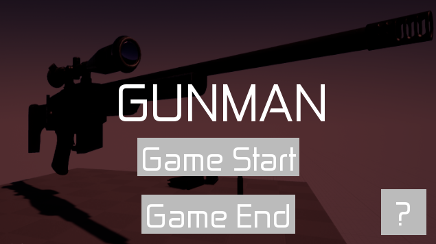
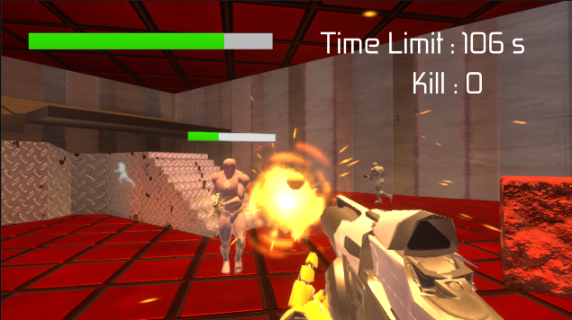
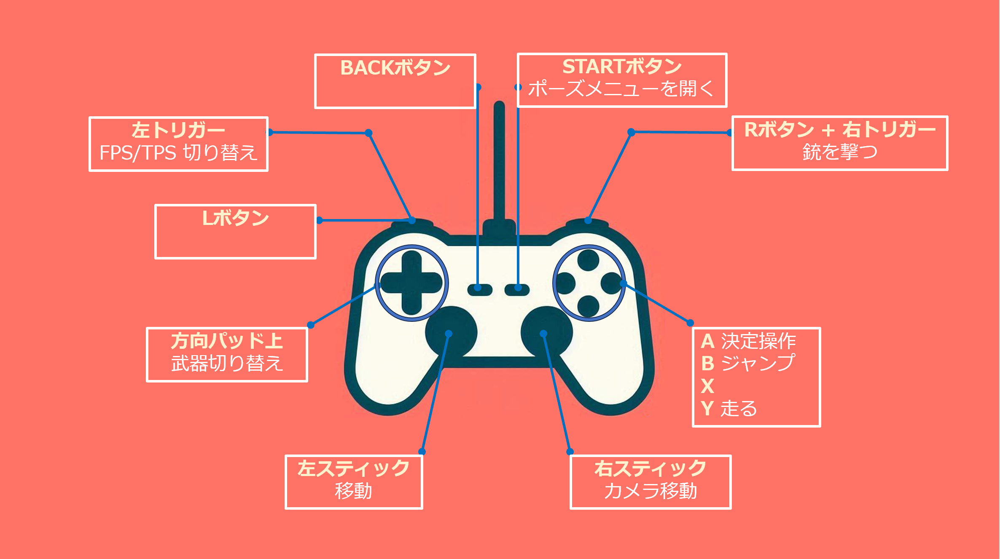

# GUNMAN

**制限時間 2 分以内に 10 体の敵を倒す**サバイバルアクション FPS/TPS ゲーム。  
Unreal Engine 5.3.2 / C++ で開発。

> [!CAUTION]
> **このリポジトリはソースコードのみを公開しています。**  
> ゲームを起動するためのアセットファイル（テクスチャ・サウンド・アニメーションなど）はほとんど含まれていないため、動作確認はできません。ソースコードの閲覧・技術確認用としてご利用ください。

---

## スクリーンショット

| タイトル画面 | バトル画面 |
|:---:|:---:|
|  |  |

---

## ゲーム概要

| 項目 | 内容 |
|---|---|
| ジャンル | FPS / TPS アクション |
| プレイ時間 | 約 2 分 / ラウンド |
| 難易度 | 普通 |
| 対象年齢 | 全年齢対象 |
| 開発環境 | Unreal Engine 5.3.2 |
| 対応 OS | Windows 10 / 11 |

### コンセプト

> **制限時間内に迫り来る敵を撃退し、生き残れ！**

フィールドを巡回する敵を発見して倒すサバイバルゲームです。  
敵はプレイヤーを見つけると追跡・攻撃してくるため、**武器選択と立ち回り**が勝負を左右します。  
TPS（三人称）と FPS（一人称）をリアルタイムに切り替えられるため、状況に応じた視点の使い分けも戦略の一つです。

### 勝敗条件

| 結果 | 条件 |
|---|---|
| **勝利** | 制限時間（2 分）内に敵を **10 体** 全て倒す |
| **敗北** | 体力が 0 になる、または制限時間切れ |

### 武器システム

開始時に 3 種類の武器から 1 つを選択します。ボタンで持ち替えも可能です。

| 武器 | 弾速 | 威力 | 特徴 |
|---|---|---|---|
| ピストル | 中 | 中 | バランス型。扱いやすく万能 |
| ショットガン | 低 | 高 | 近距離で絶大な威力 |
| ライフル | 高 | 低 | 高速連射。遠距離向き |

### 敵の行動

```
発見前：フィールドを巡回（PathA ルート / PathB ルート / ランダム の 3 種）
    ↓ プレイヤーを視界に捉える（AI Perception）
追跡：プレイヤーへダッシュ移動
    ↓ 一定距離に接近
攻撃：ライントレースでプレイヤーにダメージ
    ↓ 5 秒以上見失う
巡回へ戻る
```

---

## 操作方法



| 操作 | ボタン |
|---|---|
| 移動 | 左スティック |
| カメラ移動 | 右スティック |
| ダッシュ | Y ボタン |
| ジャンプ | B ボタン |
| 武器切り替え | X ボタン |
| FPS / TPS 視点切り替え | 左トリガー |
| エイム（TPS） | 右トリガー |
| 射撃（TPS） | 右トリガー押しながら R ボタン |
| 射撃（FPS） | L ボタン |
| ポーズメニュー | START ボタン |
| 決定 | A ボタン |

---

## 技術的な特徴

このプロジェクトでは以下の技術を実装しています。詳細は各リンク先を参照してください。

| 特徴 | 概要 |
|---|---|
| **FPS / TPS リアルタイム視点切り替え** | カメラ・メッシュ・照準 UI・入力制御が連動して切り替わるデュアルカメラシステム |
| **データ駆動武器システム** | 武器パラメータを DataTable（`DT_Weapon`）に集約。C++ を変更せず武器を追加できる |
| **Behavior Tree AI** | 巡回・追跡・攻撃の 3 状態を AI Perception と Behavior Tree で制御 |
| **インターフェース疎結合設計** | 4 つの `BlueprintNativeEvent` インターフェースでシステム間の依存を排除 |
| **AnimNotify による発砲同期** | アニメーションの進行と発砲タイミングを AnimNotify で正確に同期 |

実装の工夫やバグ修正の詳細は **[アピールポイント](Documentation/AppealPoint.md)** にまとめています。

---

## ソースコードドキュメント

| ドキュメント | 内容 |
|---|---|
| [アーキテクチャ概要](Documentation/Architecture.md) | システム全体の設計・クラス継承ツリー・モジュール間の関係 |
| [アピールポイント](Documentation/AppealPoint.md) | 実装上の工夫 5 項目・バグ修正の記録 2 項目 |
| [プレイヤーキャラクター](Documentation/Character/README.md) | 移動・射撃・視点切り替え・武器管理（`GUNMANCharacter` など） |
| [アニメーション](Documentation/Animation/README.md) | AnimInstance・AnimNotify・アニメーションインターフェース |
| [敵 AI](Documentation/Enemy/README.md) | Behavior Tree による巡回・追跡・攻撃システム |
| [ゲームモード](Documentation/GameMode/README.md) | シーンごとのゲームルール・タイマー・勝敗判定 |
| [マップ (LevelScript)](Documentation/LevelScript/README.md) | 各マップの UI・Enhanced Input によるメニュー操作 |
| [UI (UMG)](Documentation/UMG/README.md) | HUD・照準・タイマー・各種メニューウィジェット |
| [武器](Documentation/Weapon/README.md) | DataTable による武器データ管理・アタッチ処理・薬莢演出 |

---

## 開発環境のセットアップ

> [!NOTE]
> アセットファイルが含まれていないため、ビルドしてもゲームとして動作しません。  
> ソースコードの確認・学習目的でのセットアップ手順です。

### 必要なソフトウェア

| ソフトウェア | バージョン |
|---|---|
| Unreal Engine | 5.3.2 |
| Visual Studio | 2022 推奨 |

### 手順

1. このリポジトリをクローンする
2. `GUNMAN.uproject` を右クリックし「Generate Visual Studio project files」を実行する
3. 生成された `GUNMAN.sln` を Visual Studio で開く
4. ビルドターゲットを `Development Editor` に設定してビルドする
5. `GUNMAN.uproject` を Unreal Engine で開く
